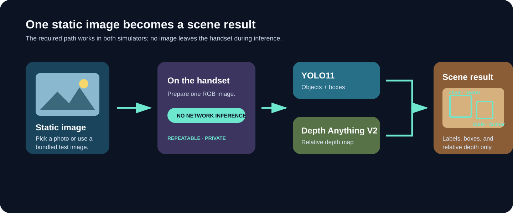
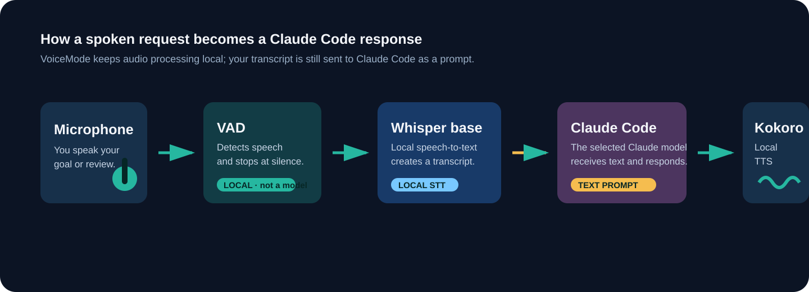
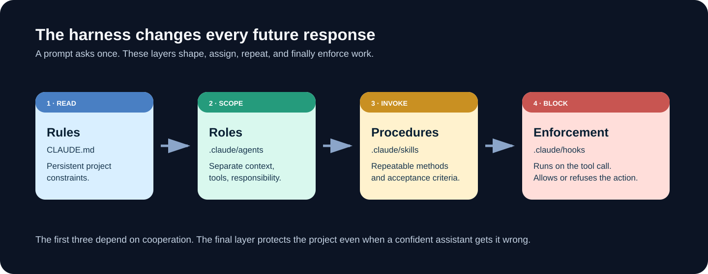
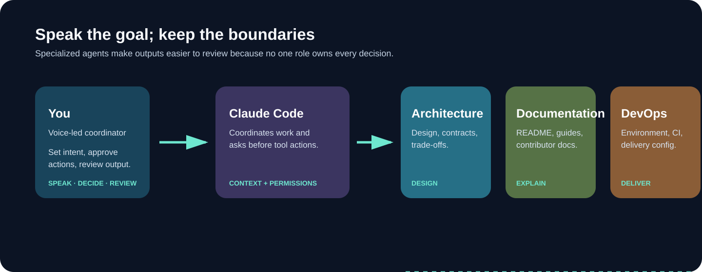

# Lesson 01 — Project Definition & System Design

> Notion Week 1. Live session: **90 minutes** (83 minutes of planned work plus a
> 7-minute contingency). Pre- and post-session homework are required and ordered below.

## Session goal

Build the **harness** before building the system. By the end of this session you will
have a repository whose structure, rules, and specialized roles are defined well
enough that an AI assistant working inside it produces consistent, reviewable output —
and you will use that harness, primarily by voice, to generate and review the Smart
Scene Analyzer's architecture.

The distinction that matters all course: a prompt is a request, a harness is a
constraint. A prompt shapes one response. A harness shapes every response, in every
future session, including the ones you are not present for. This session builds the
harness.

### What you are going to build

Across this course, you will build the **Smart Scene Analyzer**: an iOS and Android
mobile app that analyzes an indoor scene on the phone. A user can select a static image
from their library (or use the bundled test image), and the app will detect objects,
draw labeled bounding boxes, and indicate each object's relative depth — for example,
which detected object is nearer or farther within that image. The app will run YOLO11
object detection and Depth Anything V2 depth estimation on-device, fuse their outputs,
and keep the image on the handset during inference.



Static images are a first-class product input, not merely a fallback for the live
camera. They work in both iOS and Android simulators, make results repeatable for model
and device-parity checks, and let you test the complete product without camera
permissions or hardware variability. Lesson 05 treats a picked or bundled still image
as the required path; live camera capture on a physical device is an optional extension.

The system does **not** estimate absolute distance in metres. Its depth output is
relative within a single image, so the product may say “nearer” or “farther,” not
“2.3 metres away.”

## Prerequisites

Run the repository checks before you continue. The macOS rows determine whether you use
the tested voice path or the supported typed fallback.

| Requirement | Check | If it fails |
|---|---|---|
| Git | `git --version` | [git-scm.com](https://git-scm.com/downloads) |
| Claude Code | `claude --version` | Already installed before this lesson |
| `uv` | `uv --version` | Already installed before this lesson |
| Python 3.11+ | `python3 --version` | Already installed before this lesson |
| macOS voice path | `sw_vers` | This is the tested primary path. Bring headphones and a working microphone. |
| Homebrew + FFmpeg | `brew --version && ffmpeg -version` | Complete pre-session step 3. VoiceMode needs FFmpeg for audio processing. |
| Node.js 20+ | `node --version` | [nodejs.org](https://nodejs.org) — not used today, needed from Lesson 05 |
| GitHub account | `gh auth status` (optional) | Create one; you push your project at the end |

> **Platform note.** VoiceMode is taught on macOS. If you use another platform, complete
> the repository work and use the typed fallback in
> [`resources/voice-command-card.md`](resources/voice-command-card.md); do not spend the
> live session debugging an untested audio stack.

## Deliverables

When this session ends, your `smart-scene-analyzer` repository contains:

- [ ] A git repository with an initial commit, pushed to GitHub
- [ ] `CLAUDE.md` — project rules loaded into every assistant session
- [ ] `.claude/settings.json` — a reviewed permission policy **and a hooks block**
- [ ] `.claude/agents/` — three role definitions (architecture, documentation, devops)
- [ ] `.claude/skills/` — this project's own procedures, read but not yet used
- [ ] `.claude/hooks/` — enforcement scripts, with three of them observed running
- [ ] `docs/requirements.md` — functional and non-functional requirements with numbers
- [ ] `docs/architecture.md` — components, data contracts, pipeline stages
- [ ] `docs/decisions/` — at least one ADR recording the inference-target decision
- [ ] `docs/roadmap.md` — the engineering plan for Weeks 2–6
- [ ] `README.md` and `CONTRIBUTING.md`
- [ ] `app/app.json`, `app/metro.config.js`, `.gitignore`, `.github/workflows/ci.yml`
- [ ] VoiceMode is installed in the student's user configuration and they can run
  `/voicemode:converse`

Verify with [`resources/checklists/deliverables.md`](resources/checklists/deliverables.md).

---

## Step-by-step

### Delivery map — do these in order

| When | Steps | Why they are there |
|---|---|---|
| **Pre-session homework** | 1–3 | Copying dependencies and installing an audio stack are long-running or machine-specific. Arrive with them verified. |
| **The 90 minutes** | 4–9 | You will learn the harness, inspect its constraints, make the requirements decision, and direct the Architecture Agent by voice. |
| **Post-session homework** | 10–13 | Turn the approved architecture into documentation, configuration, a roadmap, and a remote repository. Complete them in this order. |

> **Voice-first convention.** Speak your goal, decision, and review request; type only
> commands, paths, code, and values that must be exact. Read every permission prompt
> before approving it. Never say an API key, password, token, or private data into the
> microphone: the audio stays local in this setup, but your transcribed prompt is still
> sent to Claude Code.

### 1. Create your project repository — pre-session homework (10 minutes)

**Do:** Create your own repo from the course template. Your project is separate from
this course repo — you read from the course, you write to yours.

```bash
# From the directory where you keep projects (NOT inside the course repo)
mkdir smart-scene-analyzer && cd smart-scene-analyzer
git init

# Copy the scaffold. Adjust the path to wherever you cloned the course.
cp -R <path-to-course-repo>/template/. .

ls -a
```

**Expected result:** the directory contains `CLAUDE.md`, `README.md`, `pyproject.toml`,
`.env.example`, `.gitignore`, `.mcp.json`, and the directories `.claude/`, `src/`,
`tests/`, `docs/`, `data/`, `notebooks/`.

> `cp -R template/. .` — the trailing `/.` copies hidden files too. Without it you
> silently lose `.claude/`, and nothing later in this lesson works.

---

### 2. Install dependencies and confirm the environment — pre-session homework (20 minutes)

**Do:**

```bash
uv sync
uv run python -c "import numpy, cv2, PIL, pydantic; print('ok')"
```

**Expected result:** `ok`. A `.venv/` directory now exists and is gitignored.

### 3. Install and verify VoiceMode — pre-session homework (25–40 minutes)

**Do:** Install FFmpeg before installing VoiceMode. Then add the official VoiceMode
plugin, install its local services, and allow your terminal application to use the
microphone when macOS asks.

```bash
brew install ffmpeg
ffmpeg -version

claude plugin marketplace add mbailey/voicemode
claude plugin install voicemode@voicemode
```

Start Claude Code after the plugin install, then run these slash commands inside it:

```text
/voicemode:install
/mcp
/voicemode:converse
```

**Expected result:** `ffmpeg -version` prints a version; `/mcp` shows VoiceMode available;
and `/voicemode:converse` records one short sentence, transcribes it, and speaks Claude's
reply. If this does not work before class, use the typed fallback in
[`resources/voice-command-card.md`](resources/voice-command-card.md) and bring the error
message to the instructor.

> **What is happening?** Voice activity detection (VAD) listens for speech and stops the
> recording after silence. Local Whisper speech-to-text (the supplied setup guide uses the
> `base` Whisper model) turns your audio into text. Claude Code sends that text to the
> Claude model selected for your session. Optional local Kokoro text-to-speech turns the
> response back into sound. VAD is a detector, not a language model; Whisper is the STT
> model; Claude is the coding model; Kokoro is the TTS model.
>
> 
>
> The microphone audio is processed locally in this path. The transcript and the task you
> ask Claude to perform are not local-only: treat them with the same care as any other
> Claude Code prompt.
>
> The current plugin route provides the slash commands above. The supplied
> [manual macOS guide](https://gist.github.com/jlmalone/02d09aeb4e09890a8a9e7c2333a18377)
> remains useful for its manual `uvx` setup, `webrtcvad` plus `setuptools<71` VAD fix,
> Whisper/Kokoro service checks, and tuning values. It omitted FFmpeg; install it first.
> Its main sequence is: register the `stdio` MCP server, install local Whisper, optionally
> install local Kokoro, start and check the services, tune VAD/silence thresholds, then
> invoke `converse`. `/voicemode:install` automates the supported plugin path; use the
> guide when you need to see or repair those individual layers.
> Sources checked 2026-08-26.

---

### 4. Read the harness before you run it — live, 12 minutes

**Do:** Open `CLAUDE.md` and read it end to end. Then open the three files in
`.claude/agents/`.

This is not a formality. `CLAUDE.md` is loaded into the context of *every* Claude Code
session in this repository — it is where a rule goes when you want it to survive the
session you are in. Rules that live only in a prompt are gone in an hour.

**The harness has four layers, and they are not interchangeable.** You will meet all four
in this session; the distinction between the last two is the one worth carrying:

| Layer | Where | How it constrains |
|---|---|---|
| **Rules** | `CLAUDE.md` | By being **read**. Loaded into every session |
| **Roles** | `.claude/agents/` | By **scope**. Separate context, restricted tools, one responsibility |
| **Procedures** | `.claude/skills/` | By being **invoked**. A repeatable method with its own acceptance criteria |
| **Enforcement** | `.claude/hooks/` | By **blocking**. Runs on the tool call, whether or not anyone read anything |



The first three all depend on cooperation. An assistant that has read a rule can still
decide, plausibly and in good faith, that this particular case is different. That is not
usually a problem — until the case that is different costs money or ships a lie to a user.
Which is exactly what the fourth layer is for, and why Lesson 02 puts the credit budget
there rather than leaving it in prose.

Notice what the file does and does not contain:

| It contains | It does not contain |
|---|---|
| Layout, and what each directory is for | Implementation detail |
| Commands to run tests, lint, types | Anything reachable by reading the code |
| Conventions an assistant cannot infer (bbox is `xyxy` absolute pixels) | Restatements of the code |
| Constraints (ask before adding a dependency) | Aspirations |

The last row is the one students get wrong. `CLAUDE.md` earns its place by carrying
what is *not* derivable from the repository. Anything an assistant could learn by
reading `src/` is noise that costs context on every single request.

**Expected result:** you can say in one sentence what each of the three agents is for.

---

### 5. Bootstrap and refine `CLAUDE.md` — live, 8 minutes

**Do:** Start Claude Code and generate a baseline, then compare it to the template
version.

```bash
claude
```

```
/init
```

`/init` scans the repository and writes a `CLAUDE.md` describing what it finds. It will
overwrite or extend the template file — that is intentional. Your job is to review its
output and keep the parts that are true, then restore the template's constraint
sections, which `/init` cannot know about.

**Expected result:** a `CLAUDE.md` that keeps the template's *Engineering roles*,
*Conventions*, and *Constraints for assistants* sections, plus anything accurate that
`/init` discovered. Two `TODO(Lesson 01)` markers remain at the bottom — you resolve
them in step 8.

> **Why not just accept `/init`'s output?** Because `/init` documents what exists. The
> value of `CLAUDE.md` is mostly in what *must be true* — the constraints. An assistant
> can read your directory tree. It cannot read your intent.

---

### 6. Review the permission policy and configuration scopes — live, 18 minutes

**Do:** Say: “Explain which Claude configuration belongs to me, which belongs to this
project, and which should be committed. Keep the answer to one table.” Then compare the
answer to this one.

| Scope | File | Use it for | Recommendation in this course |
|---|---|---|---|
| **User** | `~/.claude/settings.json` | Your preferences across every project | Theme, editor behavior, personal defaults — never team policy. |
| **Shared project** | `.claude/settings.json` | Versioned team settings | Commit the harness's permissions, hooks, and shared environment settings. |
| **Project local** | `.claude/settings.local.json` | Your private override in this one project | Test a setting or allow only your VoiceMode `converse` tool. Keep it out of git. |

`CLAUDE.md` is different: it is project instruction memory, not JSON settings.
`CLAUDE.local.md` is a private, project-specific instruction file and must also be
gitignored. Check `/status` to see which settings sources Claude Code loaded.

**Expected result:** you can choose the narrowest scope that reaches the intended people.

**Do:** Open `.claude/settings.json` and read the three lists.

```jsonc
"allow":  // runs without asking
"ask":    // prompts every time
"deny":   // refused outright
```

Walk the reasoning:

- `git status`, `git diff`, `uv run` are in `allow` — read-only or trivially
  reversible, and prompting on them trains you to click *yes* without reading.
- `git push`, `git commit`, `uv add`, `npm install`, `npx expo run` are in `ask` — each
  has a cost outside your working tree, changes the dependency surface, or takes minutes
  of native build time.
- `.env` and `*.pem` are in `deny` — an assistant never needs to read a secret to do
  its job, and content it reads can end up in output.

**Do:** Verify the policy is loaded:

```
/permissions
```

**Expected result:** the rules from `settings.json` are listed.

#### Connect tools safely: MCP transport and scope

**Do:** Say: “Explain the transport and scope of the VoiceMode server, then show me how
to inspect it without changing the project configuration.” Run:

```text
/mcp
```

| Transport | Meaning | Use it when |
|---|---|---|
| `--transport stdio` | Claude Code starts a local process and exchanges MCP messages through standard input/output. | A tool needs local microphone, filesystem, or shell access. VoiceMode is this kind of server. |
| `--transport http` | Claude Code calls a remote Streamable HTTP endpoint. | A cloud MCP service exposes an HTTPS `/mcp` endpoint; this is the recommended remote transport. |
| `--transport sse` | Claude Code connects to a remote Server-Sent Events endpoint. | Only when a service exposes SSE; it is deprecated in favor of HTTP. |
| `ws` | A persistent WebSocket connection for server-pushed events. | Configure it as JSON `"type": "ws"`; it is not accepted by `claude mcp add --transport`. |

| MCP scope | Stored in | Recommendation |
|---|---|---|
| **Local** | A per-project entry in `~/.claude.json` | Personal experiment for one project. Do not confuse this with `.claude/settings.local.json`. |
| **Project** | `.mcp.json`, committed | Shared, non-secret tools such as the course's Roboflow configuration. |
| **User** | `~/.claude.json`, across your projects | VoiceMode: it is your microphone and a personal utility, not a repository dependency. |

The VoiceMode plugin configures its own local `stdio` server. Do **not** add it to this
project's `.mcp.json`. If repeated microphone permission prompts make voice use
impractical, add only the exact `converse` tool shown by `/mcp` to your own
`.claude/settings.local.json`. Plugin tools use a different name prefix from direct MCP
tools, so inspect before copying a permission rule. Do not allow every VoiceMode tool.

**Expected result:** `/mcp` identifies VoiceMode as available, and you can explain why its
configuration is personal while the Roboflow server in `.mcp.json` is shared.

> **The course never uses `--dangerously-skip-permissions`.** Reviewing what an
> assistant is about to do is not friction to be removed — it is the part of the
> harness that catches the confident mistake. Skip it and you have a code generator
> again.

#### What a permission rule cannot do

Scroll further down `settings.json` to the `hooks` block, and open the scripts it points
at in `.claude/hooks/`.

A permission rule pauses and asks **you**. That works exactly as well as your attention
does — and the twentieth prompt in a session gets the same click as the first. A hook does
not ask. It runs a script before or after the tool call, and a `PreToolUse` hook exiting
with status 2 means the call does not happen.

Six ship with the scaffold. Two of them block:

| Hook | Fires on | Effect |
|---|---|---|
| `session_balance.py` | Session start | Prints the remaining credit balance into context |
| `notify_done.py` | The turn ending, or the assistant waiting on you | Raises a desktop notification. Never blocks |
| `format_python.py` | After `Write`/`Edit` | `ruff format` + `ruff check --fix`. Never blocks |
| `credit_gate.py` | Before billed Roboflow tools | **Blocks** unless the ledger has a pending estimate that fits the balance |
| `units_guard.py` | Before `Write`/`Edit` to `src/` or `app/` | **Blocks** any metric-depth identifier, in Python or TypeScript |
| `artifact_drift.py` | After editing an export config | Warns that the bundled model artifacts are older than what produced them |

**Do:** Watch the one that has already fired. Open `.claude/hooks/notify_done.py`, then
look at the `Stop` entry in `settings.json`.

```json
"Stop": [
  {
    "hooks": [
      {
        "type": "command",
        "command": "python3 ${CLAUDE_PROJECT_DIR}/.claude/hooks/notify_done.py",
        "timeout": 10
      }
    ]
  }
]
```

**Expected result:** you have been getting a desktop notification at the end of every
turn since your first prompt in this repository, and you did not configure anything to
make that happen — copying `template/` was enough. On macOS the first one may have been
swallowed by a permission prompt from your terminal app; approve it and the next turn
will land. On Linux it needs `notify-send`; on Windows, and anywhere without a
notification daemon, the hook falls back to the terminal bell rather than failing.

> Note what `Stop` does **not** have: a `matcher`. Tool events like `PreToolUse` match on
> which tool is about to run, because "before a billed Roboflow call" is a meaningful
> subset. There is no subset of "the turn ended", so the event fires every time and the
> filtering, if you want any, belongs inside your script.
> ([Claude Code hooks reference](https://code.claude.com/docs/en/hooks), checked
> 2026-08-13.)

This is the only hook in the scaffold written for **you** rather than for the code.
Nothing in `src/` is safer because it exists. It is here because a training run in
Lesson 03 and an export in Lesson 04 both take long enough that you will switch windows,
and because meeting the mechanism somewhere harmless is the cheapest place to meet it.

The same script is wired to a second event, `Notification`, which fires when the assistant
is blocked **on you** — most often a permission prompt. Both entries point at the same
file, and the script tells them apart by reading `hook_event_name` from the payload:

```json
"Notification": [
  { "hooks": [ { "type": "command", "command": "python3 ${CLAUDE_PROJECT_DIR}/.claude/hooks/notify_done.py", "timeout": 10 } ] }
]
```

That pairing matters more here than it would in most projects. This course never uses
`--dangerously-skip-permissions`, so an assistant working through a long task stops and
waits for you repeatedly — and a permission prompt nobody is looking at is indistinguishable
from work still in progress. "Done" and "waiting on you" are the two states worth being
interrupted for, and now both interrupt you.

**Do:** Watch a second harmless one work. Ask for a deliberately badly formatted file.

```
Create src/smart_scene_analyzer/scratch.py containing:
x=1
def  f( a,b ):
     return a+b
```

**Expected result:** the file is written, and when you read it back it is formatted. You
did not ask for that, and nothing in `CLAUDE.md` requested it. Delete the file.

**Do:** Now watch one that blocks.

```
In src/smart_scene_analyzer/__init__.py, add a comment reading
"# depth values are returned in meters"
```

**Expected result:** the edit is **refused**, with a message explaining that this project
returns relative inverse depth and no identifier or comment in `src/` may imply metres.
The assistant cannot proceed by rewording, retrying, or writing the file another way.

> Sit with the difference. `CLAUDE.md` already said depth is not metres — that rule has
> been loaded into context this entire session. It is a good rule, correctly stated, and
> a sufficiently confident model at eleven at night will write `depth_meters` anyway
> because in that moment it seems obviously right. The hook does not care what seemed
> right. **That is the entire distinction between a rule and a constraint**, and Lesson 02
> puts your Roboflow budget on the far side of it.
>
> One consequence worth naming now: if a hook blocks you, the fix is to satisfy it. Not to
> edit the hook, and not to route around it. A hook you can talk your way past is a
> comment.

---

### 7. Understand the subagent definitions — live, 10 minutes

**Do:** Open `.claude/agents/architecture.md` and look at the frontmatter.

```yaml
---
name: architecture
description: Use for system design work — ...
tools: Read, Grep, Glob, Write, Edit, WebFetch
model: opus
---
```

| Field | What it does |
|---|---|
| `name` | How you invoke it |
| `description` | **How the main assistant decides to delegate.** Written for a dispatcher, not a human. This is the field students under-invest in. |
| `tools` | The agent's capability boundary. Architecture has no `Bash` — it designs, it does not run things. |
| `model` | Design work gets `opus`; mechanical work gets `sonnet` |



A subagent also gets its **own context window**. That is the real reason to use one:
the Architecture Agent can read forty files to produce one design document, and none of
that reading pollutes your main session.

**Do:** Confirm they are registered:

```
/agents
```

**Expected result:** `architecture`, `documentation`, `devops`, `dataset-engineer`,
`data-pipeline`, and the rest of the ten — through `mobile`, which Lesson 05 uses — are
listed. Only the first three matter today.

**Do:** Finally, look at the layer between roles and enforcement.

```
/skills
```

**Expected result:** five project skills are listed — `credit-ledger`, `error-triage`,
`annotation-conversion`, `dataset-qa-sweep`, `offline-suite`.

Open `.claude/skills/credit-ledger/SKILL.md` and read the `description` in its
frontmatter. It is written the same way an agent's `description` is: for a dispatcher
deciding whether this is the right thing to reach for, not for a human browsing a menu.

You will not invoke any of them today — Lesson 01 spends nothing, trains nothing, and
tests nothing. They are here so that when you meet the vendor's `roboflow:*` skills in
Lesson 02, the distinction is already concrete: those encode Roboflow's knowledge, these
encode your project's, and when the two disagree yours wins because it is the one that
knows your budget.

---

### 8. Define requirements — including the numbers — live, 15 minutes

**Do:** Fill in
[`resources/templates/requirements-worksheet.md`](resources/templates/requirements-worksheet.md).
Copy it to your project as `docs/requirements.md` and complete it.

```bash
cp <path-to-course-repo>/lessons/01-project-definition-and-system-design/resources/templates/requirements-worksheet.md docs/requirements.md
```

The non-functional section is the one that changes the architecture. "Fast" is not a
requirement. "p95 end-to-end latency under 400 ms for a 1280×720 image" is — it
determines model size, whether depth and detection run in parallel, and whether you can
afford a network hop per request.

**The client is a real application, and that is now settled.** Lesson 05 builds an Expo
app for iOS and Android. Write your requirements for a user holding a phone, not for a
`curl` command — it changes which non-functional numbers matter.

In particular, **N1 must name what it is measured on.** "p95 latency under 800 ms" is not
a requirement anyone can pass or fail until you say on which device, in which build, and
whether the seconds-long one-time model load counts. Those are different questions
depending on which row of the fork below you choose, which is why this requirement cannot
be finished before that decision is. Lesson 05 supplies the measurement.

⚠️ **OPEN — resolve this before step 8.** The single biggest architectural fork is the
**inference target**, and it is not yet decided for this course:

| Option | Consequence |
|---|---|
| **Cloud, self-hosted** — your container serves both models | Simpler pipeline, one codebase, a network round-trip per frame. Zero per-image platform cost, since the weights are yours |
| **Cloud, hosted API** — detection served by Roboflow | No weights in your image, but **bills per request** — and a camera app makes far more requests than a `curl` loop |
| **On-device** — TFLite / ExecuTorch / Core ML | No round-trip, works offline, image bytes never leave the phone. Forces per-platform export, quantization, and numerical validation of two models; ships tens of MB of runtime; sets a device floor; and a model update becomes an app-store release rather than a deploy |

Pick one, then record it:

```
/adr inference target: cloud vs on-device
```

> Two rows deserve the hardest thought, for opposite reasons. **The middle row** looks like
> the cheap option — no weights to ship, no GPU to size — and it is the only one whose cost
> scales with how much anyone uses your app; a camera client makes far more requests than a
> `curl` loop. **The bottom row** looks like the expensive one, and it is: it trades a
> hosting bill for an export toolchain, two native runtimes, and an app-store release cycle
> for every model update. Neither is free. They are expensive in different currencies, and
> naming the currency is most of what this ADR is for.
>
> Lesson 04 measures the options and closes this decision; Lesson 05 lives with whatever
> you chose. **This course's own worked instance chose on-device** — see
> `smart-scene-analyzer/docs/decisions/0003-on-device-inference-target.md` — and Lessons 04
> and 05 are written for that path. Choosing differently is legitimate and means adapting
> them.

**Expected result:** `docs/requirements.md` with numeric targets, and
`docs/decisions/0001-inference-target.md`. Update the first `TODO(Lesson 01)` marker in
`CLAUDE.md`.

---

### 9. Run the Architecture Agent — live, 20 minutes

**Do:** Open the prompt in
[`resources/prompts/01-architecture-agent.md`](resources/prompts/01-architecture-agent.md).
Then say: “Use the architecture role and the prompt I opened. Create the design artifacts
only; do not implement function bodies. Before writing, repeat the inference-target
decision and the acceptance criteria back to me.” Speak your review notes after it
finishes; type exact filenames or corrections only when needed.

**Expected result:** `docs/architecture.md` containing a component diagram, one named
data contract per module boundary (with units and coordinate conventions), a latency
budget allocated across stages, and a rationale per major choice. Plus module stubs
under `src/smart_scene_analyzer/` with docstrings and no function bodies.

**Review it against the template scaffold.** The directory shape the agent produces
should be close to `template/`'s. Where it differs, decide which is better — do not
assume either is right. Being able to judge an assistant's architectural output is the
skill this session is actually teaching.

**Red flags to reject and re-run:**

- A data contract that says "detections" without stating the type, units, and frame
- Implementation bodies (you asked for design)
- A latency budget that does not sum to your requirement
- Silent resolution of a decision you marked open

#### Live-session cut lines

The planned live steps total **83 minutes**. Keep the remaining seven minutes for
permission prompts, a VAD retry, or discussion. If the room runs behind, shorten these
in order: the MCP transport comparison, then the badly formatted-file hook demonstration,
then the agent-registration tour. **Never cut** the voice readiness check, the
rule-versus-enforcement distinction, or the student's critical review of the architecture.

---

### 10. Run the Documentation Agent — post-session homework, 30 minutes

**Do:** Use [`resources/prompts/02-documentation-agent.md`](resources/prompts/02-documentation-agent.md).

**Expected result:** a rewritten `README.md` (replacing the template placeholder) and a
new `CONTRIBUTING.md`.

**Verify by the harshest available test:** delete your `.venv/`, follow your own README
setup section verbatim, and see whether it works.

```bash
rm -rf .venv && uv sync && uv run pytest
```

If a step is missing or wrong, that is a documentation bug — fix it now, while you
still remember what the correct step was.

---

### 11. Run the DevOps Agent — post-session homework, 25 minutes

**Do:** Use [`resources/prompts/03-devops-agent.md`](resources/prompts/03-devops-agent.md).

**Expected result:** `app/app.json` (permissions and the native ML config plugins),
`app/metro.config.js` (with `tflite` and `pte` in `assetExts`), a `.gitignore` that excludes
build outputs and the generated native directories, and `.github/workflows/ci.yml`.

**Do:** Check the agent's work yourself. Do not take its word for it.

```bash
python3 -c "import json; json.load(open('app/app.json')); print('app.json: valid')"
grep -E "tflite|pte" app/metro.config.js
git check-ignore -v app/ios app/android node_modules data/dummy runs/dummy
```

**Expected result:** `app.json` parses; `metro.config.js` names **both** `tflite` and
`pte`; and `git check-ignore` prints a matching rule for every path. A path it says
nothing about is a path that will be committed.

> **Why `assetExts` is worth checking by hand.** Metro silently omits an asset whose
> extension it does not recognise. A missing `tflite` line does not fail the build — it
> produces an app that loads, then fails at inference against a model path that looks
> completely correct. You will meet this again in Lesson 05, step 4.

⚠️ **OPEN — the build itself is not proven here.** These three commands check that the
config *says* the right thing, not that a build *works*; `app/` has no `package.json`
until Lesson 05, so `npx expo` and `tsc` have nothing to run against. The first real
proof is Lesson 05 step 3, and a config error written today surfaces there. Deciding
whether Lesson 01 should scaffold enough of `app/` to be buildable is tracked in
`TODO.md`.

⚠️ **OPEN — MLflow hosting.** Lesson 03 needs a tracking server, and where
MLflow runs (local Docker / self-hosted server / managed) is undecided. The DevOps
Agent defaults to local MLflow with a named volume and labels it a placeholder. Record
the choice when it is made:

```
/adr mlflow hosting strategy
```

---

### 12. Generate the engineering roadmap — post-session homework, 10 minutes

**Do:** Use [`resources/prompts/04-roadmap.md`](resources/prompts/04-roadmap.md).

**Expected result:** `docs/roadmap.md` covering Weeks 2–6, where each milestone names
its deliverable, its owning role, and its entry condition — not just a list of tasks.

---

### 13. Commit and push — post-session homework, 10 minutes

**Do:**

```bash
git add -A
git status          # read this. Confirm no .env, no data/, no .venv/
git commit -m "Lesson 01: project scaffold, harness configuration, and system design"
gh repo create smart-scene-analyzer --private --source=. --push
```

**Expected result:** a pushed repository. `git status` before committing must show no
`.env`, no `data/`, no `.venv/`, and no model weights.

---

## Verification

Work through
[`resources/checklists/deliverables.md`](resources/checklists/deliverables.md). The live
session is complete when steps 4–9 are complete; the lesson is complete when the ordered
post-session steps and every checklist box are complete.

Voice readiness pass:

```text
/mcp
/voicemode:converse
/status
```

**Expected result:** VoiceMode is available, one spoken exchange works, and `/status`
shows the settings sources Claude Code actually loaded. If any voice check fails, use the
typed fallback card; it is a supported path, not a reason to delay the room.

Fast automated pass:

```bash
uv run ruff check .
uv run pytest
python3 -c "import json; json.load(open('app/app.json')); print('app.json: valid')"
echo '{"hook_event_name":"Stop","last_assistant_message":"hook check"}' \
  | python3 .claude/hooks/notify_done.py && echo "notify_done: exit 0"
git status --porcelain | grep -E '\.env$|^\?\? data/' && echo "LEAK — fix .gitignore" || echo "clean"
```

The `notify_done.py` line is how you test any hook without waiting for its event: a hook
reads a JSON payload on stdin and answers with an exit code, so a pipe is the entire test
harness. You will use the same trick in Lesson 02 on a hook that actually blocks.

The real check is qualitative: **open `docs/architecture.md` and find one thing you
disagree with.** If you cannot, you have not read it critically enough. Every generated
architecture contains at least one choice worth arguing about — finding it is the
skill.

---

## Open items

- ⚠️ **Inference target** — self-hosted cloud, hosted API, or on-device (step 8).
  Notion Open Decision #2. Blocks a final architecture. Lesson 04 measures all three;
  Lesson 05 revisits the on-device branch once a real client exists.
- ⚠️ **MLflow hosting** — a local server, self-hosted, or managed (step 11). Notion Open
  Decision #4. Determines Lesson 03's tracking setup. Note that nothing else in this
  project needs Docker any more, so a containerized tracker would reintroduce a
  prerequisite the rest of the course has dropped.
- ⚠️ **N1's shape** — which device it is pinned to, and whether cold model load counts
  toward it (step 8). Cold load is seconds long, happens once per launch, and the user
  watches it. You choose the shape now; Lesson 05 supplies the number that fills it.
- ⚠️ **Codex** — the course lists OpenAI Codex alongside Claude Code. This lesson is
  Claude Code only; the `AGENTS.md` and `codex plugin` equivalents are not yet written.
  Note that **Codex does not run the hooks you met in step 6** — those two constraints
  become yours to keep there.

All four are tracked in the course [`TODO.md`](../../TODO.md).

> **Resolved since this lesson was first written:** *mobile app scope*. It is a real
> client application — an Expo app for iOS and Android, built in Lesson 05. The
> architecture's outermost layer is a component with a contract, not a placeholder.

---

## Further reading

- [VoiceMode manual macOS setup guide](https://gist.github.com/jlmalone/02d09aeb4e09890a8a9e7c2333a18377)
  — manual VAD, Whisper, and Kokoro diagnosis
- [Claude Code cheatsheet](https://support.claude.com/en/articles/14553413-claude-code-cheatsheet)
- [Claude Code Cheat Sheet](https://cc.storyfox.cz/)
- [Claude Code — MCP](https://code.claude.com/docs/en/mcp) — transport types, scopes, and
  the `--` separator for local `stdio` servers
- [Claude Code — memory and `CLAUDE.md`](https://code.claude.com/docs/en/memory)
- [Claude Code — subagents](https://code.claude.com/docs/en/sub-agents)
- [Claude Code — settings and permissions](https://code.claude.com/docs/en/settings)
- [Claude Code — slash commands](https://code.claude.com/docs/en/slash-commands)
- [Claude Code — hooks](https://code.claude.com/docs/en/hooks) — the reference for step 6's
  `hooks` block, including the exit codes and the `PreToolUse` decision fields
- [Claude Code — skills](https://code.claude.com/docs/en/skills)
- [Architecture Decision Records](https://adr.github.io/)

Claude Code and VoiceMode references above were checked **2026-08-26**.

### Instructor visual notes

The three static diagrams above are the source visuals for this lesson. Reuse them in
slides or handouts rather than drawing a second version. If you add a title slide image,
use a microphone waveform flowing into a terminal transcript; do not put instructional
text only inside that decorative image.

**Next:** [Lesson 02 — Dataset Engineering](../02-dataset-engineering/)
