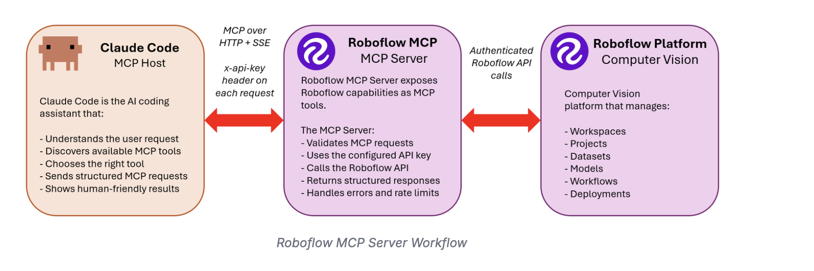

# Lesson 02 — Dataset Engineering

> Notion Week 2. Estimated time: **3–4 hours** for the required path, plus dataset
> download time (SUN RGB-D is ~6 GB; start the download before the session). Two
> optional steps — the Auto Label audit (10) and the NYU converter (14) — add 1 and 2–3
> hours respectively and are marked as optional where they appear.

> **This lesson has been run end to end against a real free-tier account.** Everything
> that went wrong, what it cost, and which step it changed is in
> [`RETROSPECTIVE.md`](RETROSPECTIVE.md). Instructors should read it before running a
> cohort. Students do not need it — its findings are already folded into the steps
> below.

## Session goal

Extend the harness with a **live external system**. Lesson 01's agents worked only on
local files; this session connects Claude Code to the Roboflow MCP server, so the
assistant can create projects, inspect annotations, and generate dataset versions on a
real platform.

That changes the stakes twice over. A file edit is reversible with `git checkout`. A
deleted Roboflow version is not — and unlike a bad file edit, some platform operations
**cost money**. This session is as much about scoping an agent's authority over a live,
metered system as it is about datasets.

By the end you have a versioned dataset from SUN RGB-D, a taxonomy that is a real
contract rather than a list, and an export that a verification script has checked —
ready for the fine-tuning story in Lesson 03. Optionally you also have a second version
from NYU Depth V2, standing in for newly acquired production data (step 14).

**You will have spent about 0.4 of your 20 credits getting there** — under half a credit
for the entire session, and zero if you skip step 10. That figure is measured, not
estimated: see [`RETROSPECTIVE.md`](RETROSPECTIVE.md).

That number is the point rather than a footnote. Step 4 builds a four-layer harness
around a budget that this lesson then barely touches, and it is worth noticing that the
harness was never the thing at risk. **Every credit actually wasted in the reference run
went on a misunderstanding, not on an expensive operation** — a version regenerated
because a control group had been destroyed by a misread instruction. Compute is what
costs money, and you do not reach it until Lesson 03. What costs you *today* is a
plausible number believed too quickly.

## Prerequisites

- [ ] Lesson 01 complete; your `smart-scene-analyzer` repo exists and is pushed
- [ ] A Roboflow account — [app.roboflow.com](https://app.roboflow.com)
- [ ] ~20 GB free disk for raw dataset downloads
- [ ] `uv sync --extra dataset` runs cleanly (installs `roboflow`, `h5py`, `scipy`)

> **Read this before creating your account.** The free **Public** plan makes your
> datasets and trained models publicly visible. That is fine for a course project built
> from public datasets, and it is what the lesson assumes. Confirm it is acceptable to
> you before uploading anything. See `roboflow:plans-and-pricing`.

> **This course has a hard budget of 20 Roboflow credits per student, for all five
> lessons.** There is no top-up. Step 4 sets up the ledger and the permission rules that
> enforce it, and it comes before any operation that touches the platform. Do not skip
> it — Lesson 06 is spending the credits you save here.

## Deliverables

- [ ] Roboflow plugin installed; `/mcp` shows `roboflow` connected
- [ ] `docs/credit-budget.md` filled in, with a starting balance, a planned allocation,
      and **the workspace slug and project ID you actually worked in**
- [ ] `.claude/settings.json` carries the credit-gating permission rules
- [ ] `.claude/agents/dataset-engineer.md` and `data-pipeline.md` in use
- [ ] A Roboflow object-detection project for the Smart Scene Analyzer
- [ ] `docs/taxonomy.md` — the class list, **numbered alphabetically** (step 12 explains
      why that is not a style choice)
- [ ] `scripts/convert_sunrgbd.py`, with a conversion report
- [ ] All uploaded images carry the `sun-rgbd` tag — verified by a count, not assumed
- [ ] A dataset version generated from SUN RGB-D
- [ ] `docs/dataset-card-<n>.md` for the version you generated
- [ ] Export in `data/`, passing `verify_export.py`
- [ ] The ledger reconciled against the Roboflow usage dashboard
- [ ] ADRs recording the acquisition path, the depth scope decision, and the class-ID
      order

*Optional, and each one states what you give up by skipping it:*

- [ ] Step 10 — the Auto Label audit: per-class agreement between Grounding DINO and the
      human annotations, recorded in the dataset card. **1 credit.**
- [ ] Step 14 — `scripts/convert_nyu.py` and a second dataset version from NYU Depth V2,
      sharing the taxonomy. **Free, but 2–3 hours, and Lesson 03's V1-vs-V2 comparison
      depends on it.**

Verify with [`resources/checklists/deliverables.md`](resources/checklists/deliverables.md).

---

## Step-by-step

### 1. Get your Roboflow API key

**Do:** Open [app.roboflow.com/settings/api](https://app.roboflow.com/settings/api),
copy the **Private API Key**, and export it in the shell you launch `claude` from.

```bash
export ROBOFLOW_API_KEY=<your-key>
export ROBOFLOW_WORKSPACE=<your-workspace-slug>   # from app.roboflow.com/<workspace-slug>
```

> ⚠️ **Get the slug from your browser's address bar, not from memory and not from the
> settings page's display name.** Open `app.roboflow.com`, click into the workspace you
> intend to use, and copy the path segment out of the URL. A display name of "Sergio's
> Workspace" can have a slug of `sergios-workspace-rdowu`, and accounts routinely have
> more than one workspace after any experimentation.
>
> This matters more than it looks. **A wrong-but-valid slug authenticates, lists, and
> returns an empty project list** — which reads exactly like "nothing has been uploaded
> yet". In the reference run it cost forty minutes and a genuine belief that 1,504
> uploaded images had been lost. Step 3 verifies it; do not skip that verification
> because this step felt easy.

Also record it in your gitignored `.env`:

```bash
cp .env.example .env      # if you have not already
# edit .env, fill ROBOFLOW_API_KEY and ROBOFLOW_WORKSPACE
git check-ignore .env     # must print: .env
```

**Expected result:** `echo $ROBOFLOW_API_KEY` prints your key, and `git check-ignore
.env` confirms it is ignored.

> The MCP server reads the key from the **environment of the process that launches
> Claude Code** — not from `.env` directly. If you keep it only in `.env`, source it
> first: `set -a && source .env && set +a && claude`. Persist the export in `~/.zshrc`
> if you would rather not think about it again.

---

### 2. Install the Roboflow plugin

**Do:** Register the marketplace and install the plugin. This is one command each, run
once per machine.

```bash
claude plugin marketplace add roboflow/computer-vision-skills
claude plugin install roboflow
```

**Expected result:** both commands succeed and report the `roboflow` plugin installed.

**What you just installed** — and why it is two things, not one:

| Component | What it provides |
|---|---|
| **MCP server** (`https://mcp.roboflow.com/mcp`) | Live, authenticated *tools*: `projects_*`, `images_*`, `versions_*`, `models_*`, `universe_*` |
| **Skills** (`roboflow:data-management`, `roboflow:training-and-evaluation`, …) | Durable *knowledge*: exact model IDs, RoboQL syntax, credit costs, preprocessing semantics |



This split is worth internalizing, because it generalizes past Roboflow. The MCP server
gives an agent the ability to *act*. The skills give it the knowledge to act
*correctly*. An agent with tools and no domain knowledge calls `versions_generate` with
plausible-looking parameters that quietly produce a bad dataset. The skills are what
stop that.

It does not, however, stop everything. In step 4 you will override one of the skills'
own recommendations, because knowledge that is correct in general can be wrong for your
budget.

<details>
<summary><b>Alternative A — install from the local clone (offline / classroom)</b></summary>

The course repo already contains a clone at `computer-vision-skills/`:

```bash
cd <path-to-course-repo>
claude plugin marketplace add ./computer-vision-skills
claude plugin install roboflow
```

Or, for a throwaway session that does not touch your installed-plugins list:

```bash
cd <path-to-course-repo>/computer-vision-skills
claude --plugin-dir .
```
</details>

<details>
<summary><b>Alternative B — MCP server only, no plugin</b></summary>

Your project already has `.mcp.json` from the Lesson 01 template, pointing at the same
server. Starting `claude` in the project directory connects it — you get the tools but
**not** the skills.

Useful if plugin installation is blocked in your environment. Understand what you are
giving up: the agent will be calling a live platform API without the reference material
that tells it what the parameters mean.
</details>

<details>
<summary><b>Per-project API keys</b></summary>

If you work across multiple Roboflow workspaces:

```bash
claude plugin install roboflow --scope local
```

Local scope installs into the current project only and reads the key from that
project's environment.
</details>

---

### 3. Verify the harness before using it

**Do:** Start Claude Code in your project and run all three checks.

```bash
claude
```

```
/plugin
/mcp
```

**Expected result:**

- `/plugin` lists `roboflow` as installed and enabled
- `/mcp` lists `roboflow` with status **connected**
- The skills list includes `roboflow:data-management`, `roboflow:training-and-evaluation`, `roboflow:inference`, `roboflow:universe`, and others

**Do:** Confirm authentication *and identity* with a read-only call. These are two
different things and only the second one catches the failure that actually happens.

```
List every Roboflow workspace my key can see, with its slug and its project count.
Tell me which one matches $ROBOFLOW_WORKSPACE. If more than one workspace exists,
list them all and ask me which to use — do not choose.
```

**Expected result:** every workspace your account owns is listed, and exactly one of
them matches the slug you exported. An empty project list is correct if this is a new
account — but only once you are certain you are looking at the right workspace.

**Troubleshooting:**

| Symptom | Cause | Fix |
|---|---|---|
| `/mcp` shows `roboflow` failed | Key not in the launching shell's environment | `export ROBOFLOW_API_KEY=...`, then restart `claude` |
| Tools present, skills missing | MCP configured but plugin not installed | Run step 2 |
| 401 / unauthorized | Wrong key type — the *publishable* key is not the *private* key | Re-copy from the settings page |
| Plugin listed but disabled | Not enabled after install | Enable it in `/plugin` |
| **Zero images / zero projects in work you know you did** | **Wrong workspace slug — the most common cause by far.** Not a lost upload | Re-read the slug from the browser URL (step 1) and re-export |
| More than one workspace listed | Normal after any experimentation | Pick deliberately and record it in the ledger — see below |

**Do:** Write the identity into the ledger, so that no later step has to guess it.

```bash
$EDITOR docs/credit-budget.md    # record: workspace slug, project ID, and the full URL
```

**Expected result:** `docs/credit-budget.md` names the workspace slug, the project ID
(the URL segment after the workspace — it has a random suffix, e.g.
`smart-scene-analyzer-gc2rv`), and the dashboard URL. Every subsequent step and every
agent reads the target from here rather than reconstructing it.

> Do not continue until `/mcp` reports connected. Every remaining step depends on it,
> and an agent that cannot reach the platform will explain what it *would* do in a way
> that reads almost exactly like having done it.

> **A rule for the rest of the lesson, and it is the one worth carrying out of it.**
> From here on you are reading numbers off a live system. When a count disagrees with
> what you expected, **the assumption is the more likely thing to be wrong.** Zero
> images means you are looking in the wrong place before it means the upload failed.
> Four tags where you expected a hundred means you have misread the design before it
> means the tagging broke. Every expensive mistake in the reference run was this, and
> none of them raised an error — the platform returned a perfectly plausible number
> every single time.

---

### 4. Set your credit budget

**This step comes before any platform operation, and that ordering is the lesson.** A
budget written after the first surprise is an incident report.

Roboflow is metered. Most of what you will do today is effectively free — uploads,
version generation, tags, RoboQL queries — but a handful of operations are not, and two
of them can consume your entire course allowance in a single call.

**Do:** Open the ledger that shipped with your scaffold.

```bash
$EDITOR docs/credit-budget.md
```

Fill in your workspace slug, confirm the starting balance, and read the rate table. Then
check what you actually have — **yourself, in a browser**:

```
app.roboflow.com/<workspace>/settings/usage
```

Read "Credits used" off the page and type it into the ledger.

> ⚠️ **Do not ask the agent to fetch this.** There is no MCP tool for usage, no
> documented REST endpoint for it on the free plan, and the dashboard is behind session
> authentication that `WebFetch` cannot carry. The reference run watched an agent try
> five distinct routes to this number and fail on all five before the student read it
> off the screen in four seconds.
>
> This is the same lesson step 10 teaches about Auto Label, arriving early: **tool
> coverage is never the whole product surface**, and the gap is not announced. An agent
> asked for a number it cannot reach will keep finding new ways to try, because every
> individual attempt looks reasonable. Recognising a missing capability is your job, and
> it is faster than watching it be rediscovered.

**Expected result:** the ledger has a workspace slug, a project ID, a starting balance
you read yourself, a planned allocation per lesson, and a date.

#### What one credit buys

Verified against `roboflow:plans-and-pricing`. Read the skill yourself — these rates
change upstream, and the skill is re-read from disk every session while this table is not.

| Operation | 1 credit | What that means here |
|---|---|---|
| Uploads | 10,000 images | 3,000 images ≈ **0.3** |
| Storage | 5,000 images/month | 3,000 images ≈ **0.6/month** |
| Version generation | 20,000 images | two versions ≈ **0.5** |
| **Auto Label** | **100 images** | **the expensive one** |
| **Model training (GPU)** | **30 minutes** | 2 credits/hour — Lesson 03's risk |
| Hosted serverless inference | 500 seconds | ~1,000 images ≈ 1 credit |
| Self-hosted inference | 3,000 images | cheaper than hosted, **not free** |
| Dedicated deployment (GPU) | 1 hour of **uptime** | 24 credits/day if you forget it |

Free, and worth knowing precisely because it shapes the whole lesson: Auto Label's
**4-image "Generate Test Results" preview**, Roboflow **Instant** training, Universe
search, RoboQL, tags, splits, and workflow authoring. Only *running* a workflow bills.

**Notice the shape of that table.** Data operations are nearly free; compute is not.
Uploading ten thousand images costs one credit. Labeling ten thousand images costs a
hundred. That asymmetry is the single most important fact in this lesson, and step 7 is
where it decides your architecture.

#### Encode the budget in the harness — all four layers

A budget you agreed to is a prompt. A budget the tool enforces is a harness. Lesson 01
step 3 named four layers; this is the first thing in the course that uses all of them, on
one subject, and it is worth watching them stack.

**Layer 1 — the rule.** `CLAUDE.md` already carries the cap, the rate table, and the
forbidden-operations list. You will read it in a moment.

**Layer 2 — the permission policy.** Add these rules to `.claude/settings.json`:

```jsonc
"ask": [
  "mcp__roboflow__trainings_create",     // 2 credits/hour
  "mcp__roboflow__models_infer",         // hosted inference, billed per second
  "mcp__roboflow__versions_generate",    // cheap, but a version is immutable
  "mcp__roboflow__workflows_run"         // billed as hosted inference seconds
],
"deny": [
  "mcp__roboflow__datasource_trigger",
  "mcp__roboflow__connect_cloud_storage"
]
```

The two `deny` entries are there because `datasource_trigger` starts a billed
cloud-storage mirror run and its `trigger` parameter **defaults to true**. You do not
need cloud storage in this course; the safest configuration for a tool you will not use
is one that cannot be called.

> ⚠️ **Check the tool names against your own install.** MCP tools are named
> `mcp__<server>__<tool>`, and a tool provided by a *plugin* is named
> `mcp__plugin_<plugin>_<server>__<tool>` — so `mcp__roboflow__trainings_create` and
> `mcp__plugin_roboflow_roboflow__trainings_create` are different strings, and a rule
> written for one does not fire for the other. Step 2 offered you two install paths. The
> scaffold lists both spellings for exactly this reason. Confirm with `/permissions`
> after a real tool call, and if a billed call went through without prompting, the rule
> is not matching — fix the name rather than trusting it.

**Layer 3 — the procedure.** Open the project skill that encodes the ritual:

```bash
$EDITOR .claude/skills/credit-ledger/SKILL.md
```

**Do:** Bring it up to date against what you just read, and make it yours. Two things
need to be true that only you can make true:

1. The **rate table** in it must agree with `roboflow:plans-and-pricing` *today*. Read
   the vendor skill, compare, and correct the project skill where they differ.
2. The **forbidden-operations table** must reflect *your* plan and *your* budget, not the
   general case.

This is what authoring a project skill actually is. You have just installed nine skills
written by Roboflow, and they are good — they will tell you exactly what a version
generation costs. What they cannot tell you is that you have twenty credits, that four of
them are allocated to today, and that this project has decided against the architecture
their own skill recommends. **A vendor skill encodes the vendor's defaults. Yours encodes
your circumstances, and that is the only reason it can win an argument with theirs.**

**Layer 4 — enforcement.** Layers 1–3 all depend on being read. This one does not:

```bash
$EDITOR .claude/hooks/credit_gate.py
```

It is about a hundred lines and worth reading all of them. It fires before any billed
Roboflow tool call, parses `docs/credit-budget.md`, and exits 2 — which blocks the call —
unless the ledger contains a row with an estimate and no actual.

**Do:** Prove it, before you need it. Ask for a version generation without recording
anything first.

```
Generate dataset version 1 now.
```

**Expected result:** the call is **blocked**, not prompted. The message names what is
missing: a ledger row with the date, lesson, operation, rate, and estimated cost.

Now add the row by hand to `docs/credit-budget.md`, leaving `Actual` blank:

```
| 2026-08-11 | 02 | Version generation, ~3000 images | 1 cr / 20k images | 0.15 |  | 0.15 | 19.85 |
```

Ask again. This time the hook passes and the `ask` permission rule fires — and *now* the
prompt you are approving has an estimate attached to it, which is the only condition under
which approving it means anything. Decline it; you generate the real version in step 13.

> Compare the two experiences. Without the hook, "estimate before you spend" is advice,
> and the moment it matters most is the moment a confident assistant is most likely to
> skip it. With the hook, the estimate is a **precondition of the call existing**. The
> ledger stops being documentation of what happened and becomes the thing that lets it
> happen.
>
> This is also why the hook does not simply block everything expensive. It blocks
> *unaccounted* spending. You can still spend the whole budget — you just cannot do it
> without having written down what you expected it to cost, which is the only part that
> was ever really at risk.

**Do:** Then read the new `## Credit budget` section of your `CLAUDE.md`, in particular
the forbidden-operations table. One entry deserves attention:

> **Never start an RF-DETR NAS run.** `roboflow:training-and-evaluation` recommends
> Neural Architecture Search as its *default first choice*. It trains dozens of child
> models over hours at 2 credits/hour — one upstream example produced **76 child models
> from a 289-image dataset** — and it fails outright on non-Core plans.

Sit with that for a second. The skill is not wrong; NAS genuinely does produce the best
model, and for a team with a budget it is good advice. It is wrong *for you*, and
nothing in the skill knows that. **This is what a project constraint layer is for.**
Vendor knowledge encodes the vendor's defaults; `CLAUDE.md` encodes yours, and when they
conflict, yours wins because it is the one that knows your circumstances.

**Expected result:** `.claude/settings.json` contains the rules above and a `hooks` block
pointing at `credit_gate.py`; `.claude/skills/credit-ledger/SKILL.md` has a rate table you
have personally reconciled against `roboflow:plans-and-pricing`; and a billed call
attempted with an empty ledger is **blocked** rather than prompted.

---

### 5. Put the Dataset Engineer to work

**Do:** Open `.claude/agents/dataset-engineer.md` (it came with the Lesson 01 template)
and read the `tools` line:

```yaml
tools: Read, Grep, Glob, Write, Edit, Bash, Skill, mcp__roboflow__*
```

That wildcard is the agent's authority over your Roboflow workspace. Then read the
**Constraints** section, which is where the authority is scoped back down: confirm
project type before creating, get explicit approval before destructive operations,
never print the key, and — new since step 4 — state the estimated cost and remaining
balance before any billed call.

Notice the division of labour between the two dataset roles:

| Agent | Operates on |
|---|---|
| `dataset-engineer` | The Roboflow **platform** — projects, annotations, versions, exports |
| `data-pipeline` | **Local files** — converters, validation, preprocessing scripts |

Two agents rather than one because the failure modes are different. Platform mistakes
are irreversible and cost credits; local mistakes are a `git checkout` away. Different
risk profiles deserve different constraint sets.

**Expected result:** you can say which of the two owns "convert SUN RGB-D annotations
to YOLO format" (`data-pipeline`) and which owns "generate version 1 with 640×640
resize" (`dataset-engineer`).

---

### 6. Survey what already exists on Roboflow Universe — 10 minutes, timeboxed

**Do:** Before building a dataset, spend ten minutes looking for one. Ask the Dataset
Engineer:

```
Search Roboflow Universe for indoor scene object detection datasets covering
furniture and household objects — chairs, tables, sofas, beds, lamps, doors.
For each candidate report: image count, class list, license, and whether it looks
suitable as a base for the Smart Scene Analyzer taxonomy.
```

**Expected result:** a shortlist with counts, classes, and licenses. **Step 7 then goes
with the converter regardless** — this step exists so that "we built it ourselves" is a
decision you made rather than one you defaulted into, and ten minutes is enough to make
it honestly. Do not let it run longer.

Two tools exist and they are not interchangeable. `universe_search` returns structured
JSON for programmatic comparison; **`universe_search_app` opens the UI with previews and
sample images, and dataset selection is a judgment call that depends on seeing them.** A
dataset whose "chair" class is 90% office chairs is a domain-shift problem you will only
notice by looking.

Searching and browsing Universe is free. ⚠️ Whether *forking* a Universe dataset into
your workspace bills is not documented in the skills. Negligible either way, but do not
assume. See [Open items](#open-items).

---

### 7. Acquire SUN RGB-D — write the converter

**The problem.** SUN RGB-D is not a native Roboflow Universe dataset. It is distributed
by Princeton as ~6 GB of raw RGB-D captures plus a MATLAB metadata file
(`SUNRGBDMeta.mat`) holding the annotations. Roboflow ingests images with annotations
in a supported format — it cannot read MATLAB structs. **Something has to convert the
annotations before anything is uploaded.**

**This course writes the converter.** The `data-pipeline` agent turns `SUNRGBDMeta.mat`
into YOLO-format labels, and you upload images that already carry human annotations.

#### Why, given the alternatives

There is an obvious-looking shortcut: skip the `.mat` file entirely, upload the raw
JPEGs, and let a foundation model produce the boxes. It is genuinely tempting — it
deletes the hardest task in the lesson. Here is what it costs, using the rates from
step 4:

| | Approach | Labeling credits | Ground truth | Time |
|---|---|---|---|---|
| **A** ✅ | Write a `.mat` → YOLO converter | **~0** | Human | 60–90 min, may stall |
| B | Find a pre-converted Universe mirror | ~0 | Human, unverified | 20 min if one exists |
| C | Substitute a Universe indoor dataset | ~0 | Human | 20 min |
| D ❌ | Upload raw images, auto-label them | **20–30** | ⚠️ Machine | 45 min |

Auto-labeling a 2,000–3,000 image subsample costs 20–30 credits at 1 credit per 100
images. **That is the entire course budget, spent in one step, before you have trained
anything.** Labeling all ~10,335 SUN RGB-D images would be ~104 credits.

The constraint decides it, but notice that the decision is not actually a sacrifice.
Path A is also the path that gives you **human ground truth**, and that turns out to
matter more than the credits:

> Fine-tuning YOLO11 on model-generated labels is knowledge distillation — a legitimate
> technique, capped at the teacher's accuracy. That is survivable for the training split.
>
> It is **not** survivable for the test split. mAP measured against Grounding DINO's
> output means "agreement with Grounding DINO," not accuracy — and Lesson 03 reads its
> entire V1-vs-V2 comparison off those numbers. Auto-label your test set and every metric
> in the rest of the course is unanchored.

Path A gives you both: no labeling spend, and metrics that mean something. This is worth
noticing as a general pattern — a hard constraint often rules out the option you would
have regretted anyway, and forces you to articulate why.

You are not skipping auto-labeling as a topic either — not entirely. Step 10 is an
optional one-credit measurement of how good it *would* have been, which is only possible
*because* you have human labels to compare against.

**Do:** Have the `data-pipeline` agent write the converter. Use
[`resources/prompts/01-sunrgbd-converter.md`](resources/prompts/01-sunrgbd-converter.md).

The prompt runs in three rounds — **inspect, convert, verify against pixels** — and the
first round exists because annotation formats are documented optimistically and
populated inconsistently. The agent will need several passes to get the struct layout
right. Budget 60–90 minutes. This is messy real-world annotation conversion, which is
the daily work of a Dataset Engineer.

**Expected result:** `scripts/convert_sunrgbd.py` produces `images/`, `labels/`, and
`classes.txt`, with a conversion report reconciling records in against records out.

**If you stall past 90 minutes**, take a fallback rather than losing the session:

| Fallback | What you give up |
|---|---|
| **B** — a pre-converted Universe mirror | ⚠️ Unverified: no mirror is confirmed to exist at the quality this course needs. Check class list, count against the ~10,335 original, license, and a visual sample. A bad mirror is worse than no mirror, because the problems surface during training |
| **C** — substitute a Universe indoor dataset | The conversion lesson entirely, and the SUN RGB-D → NYU domain-adaptation pairing the course is built around. Say in your dataset card that you substituted, and why |

Either way, record what you did: `/adr dataset acquisition path for SUN RGB-D`.

#### Subsample before you upload — and carve out the holdout here

You do not need all 10,335 images. **1,500 is ample** for a course-scale fine-tune, and
it keeps storage at roughly 0.6 credits/month. Sample across the capture sessions rather
than taking the first 1,500, or you will train on one building. Use a fixed seed so the
sample is reproducible.

**Have the converter emit two disjoint sets in the same pass:**

| Set | Count | Where it goes | Why here |
|---|---|---|---|
| Training pool | ~1,500 | Uploaded to Roboflow in step 9 | The dataset |
| **Audit holdout** | **100** | **`data/audit-gt/` on disk. Not part of the step 9 upload.** | Step 10's control group |

**The holdout's only job is to be data the dataset version has never seen.** Its
converter-produced YOLO labels stay on your disk permanently — those are the ground
truth step 10 measures against, and they are never uploaded to anything. The *images* go
up only if you choose to do step 10, and only in step 10, where they are tagged `audit`
so that step 13 can exclude them. A control group that trained the model measures
nothing.

Carving both sets out of one seeded sampling pass is what guarantees they are disjoint.
Do it later, by hand, and you are picking 100 images out of a pool you already uploaded
— which is not a holdout, however it is labelled.

> ⚠️ **Track where the holdout is at each step; the reference run got this wrong and it
> was the most expensive mistake in the session.** After step 7 it is on disk. After
> step 9 it is *still* on disk — step 9 uploads the training pool only. It reaches the
> platform in step 10, or never. Step 13 filters it out either way.

#### Depth: a scope decision, not a storage problem

**Roboflow stores bounding boxes, polygons, keypoints, and image-level labels. It does
not store depth maps.** SUN RGB-D's depth channel cannot be versioned in Roboflow
alongside the boxes.

Earlier drafts of this course treated that as a storage problem to solve — S3, DVC, or
GitHub Releases for the depth arrays, plus a mapping from Roboflow image ID to depth
map. **This course takes the other branch: depth is inference-only.**

Lesson 03 runs Depth Anything V2 and Lesson 04 serves its output, but neither evaluates
it against ground truth. The consequence is specific and you should be able to state it:

- ✅ You can say "the chair is nearer than the wall" — relative ordering
- ❌ You cannot say "the chair is 2.3 m away", and you cannot report depth error

Depth Anything V2 outputs **relative inverse depth** — larger means nearer, the scale is
arbitrary, and it is not metres. Without ground truth there is nothing to calibrate
against, so the honest thing is to carry the relative units all the way to the API
response. Lesson 04 makes that a schema-design problem.

**Do:** Record it: `/adr depth scope: inference only`.

Keeping the original SUN RGB-D and NYU images still matters — if a later cohort wants
quantitative depth, the raw depth channel is still in the download, and only the storage
decision has to be made.

---

### 8. Create the Roboflow project

**Do:** Ask the Dataset Engineer:

```
Create a Roboflow object detection project called "smart-scene-analyzer" in my
workspace, with annotation group "object". Show me the exact parameters before
you call projects_create.
```

**Expected result:** the agent shows the parameters, you approve, and the project is
created. `projects_list` then shows it.

> **Project type cannot be changed after creation.** Object Detection is correct here —
> the Smart Scene Analyzer detects and classifies with YOLO11. If you later want
> segmentation, that is a new project, not an edit. Confirm the type before approving.

---

### 9. Upload the images

**Do:** Choose by dataset size (see `roboflow:data-management`).

| Images | Method |
|---|---|
| < 1,000 | Web UI drag-and-drop at `app.roboflow.com` |
| > 1,000 | The CLI |

Login in to the Roboflow account that owns or has access to `smart-scene-analyzer`
```
uv run roboflow login
```

```bash
uv run roboflow -w $ROBOFLOW_WORKSPACE import -p smart-scene-analyzer <path-to-converted-dataset>
```

**Expected result:** the upload completes and the image count in the web app matches
your converted dataset, minus skipped duplicates.

Limits worth knowing before you start a multi-hour upload: **20 MB per image**,
**16,400 × 10,900 px** maximum, and **duplicate images are skipped automatically** (by
content hash, so re-running an interrupted upload is safe).

**Do:** Tag the source — **after** the upload, because the CLI cannot do it during one.

Tags are how you keep two sources separable inside one project. Tag the SUN RGB-D images
`sun-rgbd`, and the NYU images `nyu-v2` if you do step 14. Version generation then
filters by tag, which is what makes a second source possible without a second project.

> ⚠️ **`roboflow import` applies no tags.** There is no tag flag on it, and no way to
> attach one at upload time from the CLI. Tagging is a separate pass over images that
> already exist. Earlier drafts of this lesson said "tag at upload time" and gave the
> untagged import command directly above it; the reference run discovered the gap four
> steps later, at version generation, when `tag:sun-rgbd` matched **zero** images.

Ask the Dataset Engineer:

```
Every image now in the smart-scene-analyzer project came from SUN RGB-D. Apply the
tag `sun-rgbd` to all of them.

Before you start: tell me how many images are in the project, and how many already
carry the tag. After you finish: re-query and tell me both numbers again.

Work in batches and key on image ID, never on filename — the project contains
duplicate filenames across distinct image IDs.
```

**Expected result:** the after-count for `tag:sun-rgbd` equals the project's total image
count. Verify it yourself rather than accepting the report:

```
How many images match `tag:sun-rgbd`? How many match `NOT tag:sun-rgbd`?
```

The second number must be **zero**. An untagged remainder produces a version quietly
missing images, and nothing downstream will mention it.

**The audit holdout is not part of this upload.** Step 7 carved 100 images out to
`data/audit-gt/` and they stay there for now. Do not upload them here, and do not tag
anything `audit` here. They go up in step 10 if you do step 10, and not at all if you
do not.

> **So `tag:audit` matching 0 at this point is the correct state** — as is a small
> number like 4, if a previous session ran Auto Label's free preview. Neither means
> tagging is broken. In the reference run this count was misread as a second instance of
> the `sun-rgbd` failure above; 100 images were pulled out of the *training pool* and
> tagged `audit` to "repair" it, which manufactured a control group out of data that was
> already in the dataset and cost a discarded version. **A count that disagrees with
> your assumption is evidence about the assumption** — the rule from step 3, and this is
> the step that charges you for ignoring it.

**Ledger:** ~1,500 images uploaded ≈ 0.15 credits. Round up and record 0.2. Tagging is
free.

---

### 10. ⏭️ OPTIONAL — Audit the auto-labeler — 1 credit, ~45–60 min

**Skip this if you are short on time.** It is the largest single credit line in the
lesson and the only one, and nothing in Lessons 03, 04, or 05 reads its output. What you
give up: the Auto Label audit table in the dataset card, and the evidence base that
Lesson 06's active-learning review loop is designed to build on. If you skip it, say so
in the dataset card rather than leaving the section blank, and leave the 100 holdout
images on disk — a later session can still run this against them.

If you do it: you skipped auto-labeling as a *strategy* in step 7. Spend one credit
finding out what that decision was worth, on your own data.

**The question:** if you had taken Path D, how good would the labels have been? Everyone
in this field has an opinion about foundation-model labeling. You are about to have a
number instead, and it is only obtainable because step 7 produced human labels to
compare against.

**Do:** Work through
[`resources/prompts/04-autolabel-audit.md`](resources/prompts/04-autolabel-audit.md).
The shape of the session:

1. **Upload the 100 holdout images now, unlabeled and tagged `audit`**, from
   `data/audit-gt/`. This is the one moment they go onto the platform — Auto Label is a
   web-app action and cannot reach images on your disk. Upload the **images only**;
   their ground-truth labels stay on disk, because comparing the machine's boxes against
   them is the entire experiment.

   **They are now in the project, so step 13's `NOT tag:audit` filter is what keeps them
   out of the dataset version.** That filter is not optional and not a formality. Check
   it after generating, not before.
2. **Have the agent draft your class prompts** from `docs/taxonomy.md`, and — more
   usefully — predict which classes will be unreliable *before* you spend anything.
3. **Run the free 4-image test** in the Roboflow UI (Images → Annotate → the batch your
   upload created → Auto Label → Generate Test Results). **No credits, unlimited
   retries.** This is your prompt-engineering loop, and it is why the audit is cheap to
   get right. It also creates the only four images in the project that legitimately
   carry the `audit` tag.
4. **Iterate on class names, descriptions, and per-class confidence** until the four
   results look correct.
5. **Run Auto Label on the 100-image batch. This costs 1 credit.** Record it in the
   ledger before you click.
6. **Export and compare** against the converter's labels for those same 100 images:

```bash
uv run python scripts/compare_autolabel.py data/audit-export data/audit-gt --report
```

**Expected result:** a per-class table of precision, recall, and IoU-matched agreement
between Grounding DINO and the SUN RGB-D annotators. Record it in your dataset card.

**What to expect** — and check the predictions from sub-step 1 above against it:

| Reliable | Fuzzy | ⚠️ Hard |
|---|---|---|
| `chair`, `table`, `sofa`, `bed`, `tv` | `cabinet`, `lamp` | `door`, `window` |

`door` and `window` are openings as much as objects, usually partly occluded, and their
box extent is genuinely ambiguous — frame included or not? Also watch for whole-scene
boxes and for stacked duplicates (the same sofa returned as both `sofa` and `chair`);
neither is fixed by a confidence threshold.

**Read the number honestly.** Disagreement is not automatically the model's fault — the
human annotators had conventions too, and where the two disagree about whether a door
frame belongs in the box, neither is *wrong*. That ambiguity is exactly why the number
matters: it tells you which classes a machine-labeled dataset would have quietly
degraded, and it is the evidence base for the active-learning review loop in Lesson 06.

**One constraint the agent cannot route around:** there is **no `auto_label` MCP
tool**. Auto Label is a web-app action. The MCP surface offers `annotations_save`,
`annotation_batches_list`, `annotation_batches_get`, and `annotation_jobs_create` —
enough to write annotations and inspect batches, not to trigger Auto Label. An agent
that reports having run it has not; it has described what it would do. This is worth
noticing as a general property of MCP-backed harnesses: tool coverage is never the
whole product surface, and the gap is not always announced.

<details>
<summary><b>Optional — the agent-driven variant, ~0.05 credits</b></summary>

The prompt file also covers a zero-shot labeling loop driven entirely by the
`dataset-engineer` agent: build a Workflow around the YOLO-World block
(`roboflow_core/yolo_world_model@v1`), validate the spec, run it on **10 images**, and
write the results back with `annotations_save`.

It is capped at 10 images because `workflows_run` handles one static image per call and
bills as hosted inference seconds — roughly 0.05 credits at this size. The point is not
the labels. It is watching an agent complete a full read → infer → write loop against a
live platform, including the coordinate-format conversion between what YOLO-World
returns and what `annotations_save` expects. A silent mismatch there writes
plausible-looking garbage into your project, which is why the prompt makes the agent
state both formats before writing anything.
</details>

---

### 11. Review the annotations

**Do:** Have the Dataset Engineer triage before you trust the data:

```
Review the annotation quality of the smart-scene-analyzer project. Use images_search
with RoboQL to find suspect images:
  - images with no annotations at all
  - images with exactly one annotation (suspicious for indoor scenes)
  - images missing the classes I would expect for their content
  - unusually small or large images

Report counts per query with example image IDs. Do not delete or modify anything.
```

RoboQL syntax you will use here (full reference in `roboflow:data-management`):

| Query | Finds |
|---|---|
| `max-annotations:0` | Unannotated images |
| `max-annotations:1` | Sparsely annotated — usually a conversion bug |
| `class:chair` | Images containing a class |
| `-class:chair` | Images *not* containing it |
| `class:chair>=3` | Three or more instances |
| `min-width:1000` | Dimension filters |
| `tag:sun-rgbd` | Filter by source tag |
| `class:chair AND NOT tag:nyu-v2` | Boolean composition |

**You are looking for converter bugs, not model errors.** That is the difference Path A
makes to this step. A spike in `max-annotations:1` means your converter kept only the
first object per record. A pile of `max-annotations:0` means it dropped annotations
silently. Both are code problems with reproducible causes, findable in an afternoon —
unlike "the foundation model missed some lamps", which is not fixable at all.
[`resources/prompts/03-annotation-review.md`](resources/prompts/03-annotation-review.md)
carries the full symptom → cause table.

**Expected result:** a report with counts. Read it before generating a version — after
generation, the version is frozen and a bad one has to be regenerated.

> **Note the constraint in the prompt: "do not delete or modify anything."** Review and
> mutation are separate operations, and separating them is the point. An agent that
> deletes what it judges to be bad annotations has made a curriculum decision on your
> behalf, irreversibly.

> **Note also what the prompt asks for: "counts per query with example image IDs."**
> That phrasing is doing real work. An agent handed a live API and a broad question will
> enumerate every record it can reach — the reference run killed a subagent that tried to
> pull 1,504 image records into its context before answering anything. RoboQL queries
> return a total; ask for the total. Fetch individual records only for the handful you
> then want to look at.

> **A note on splits.** Two separate claims get run together here, and only one of them
> is reassuring.
>
> *The reassuring one:* Roboflow rebalances splits during version generation, which is a
> problem for anyone mixing trusted and untrusted labels in one project — they need
> verified images pinned to valid and test, and it is not documented whether a manual
> assignment survives generation. Under Path A every label came from the same
> human-annotated source, so that concern does not arise. You dodged it.
>
> *The one that still bites:* generation rebalances **within the set it selects**. It
> does not repair a project whose split assignment is already skewed, and **images with
> no annotations are not in the pool at all** — they sit outside every split and simply
> do not appear. If your `max-annotations:0` count above was non-trivial, expect the
> generated splits to be smaller than the project total, and expect the difference to be
> exactly those images. Step 13 rebalances explicitly before generating for this reason.

---

### 12. Define the taxonomy

**Do:** Copy the template and fill it in:

```bash
cp <path-to-course-repo>/lessons/02-dataset-engineering/resources/templates/taxonomy.md docs/taxonomy.md
```

#### ⚠️ Number the list alphabetically, and do it now

**Roboflow sorts class names alphabetically when it exports a dataset version. This is
not configurable, and the export is what your training data actually says.** Whatever
order you write into `docs/taxonomy.md`, `data.yaml` will come back as
`bed, cabinet, chair, door, …`.

So if you number the list in the order the classes occur to you — `chair` first because
it is the obvious one — then `docs/taxonomy.md` says `chair = 0` and every label file in
your export says `bed = 0`. Nothing errors. `verify_export.py` catches it in step 17,
which is five steps and one dataset version too late; in the reference run, discovering
it there cost ninety minutes, an ADR, a renumber across five files, and a converter
re-run.

**Write the class list in alphabetical order from the start.** It costs nothing to do
now and it makes the taxonomy agree with the artifact by construction.

Two consequences worth internalizing rather than just complying with:

- **"Append only" is no longer sufficient.** The template's rule — add new classes at the
  end, never renumber — assumes you control the order. Under alphabetical sorting, adding
  `desk` to this list *inserts* it at index 3 and shifts five classes down. Adding a class
  is therefore a **retrain and re-export**, not an append. Say this out loud once; it is
  the kind of thing that gets discovered in Lesson 06.
- **The export defines the contract, not your document.** This is the same principle as
  `app/assets/models/` being what runs. Where the two disagree, the platform wins, and
  your job is to make the document match rather than the other way round.

Record the decision: `/adr class ID order follows the export`.

The taxonomy is a **contract between two datasets that were annotated by different
people with different conventions**. SUN RGB-D and NYU Depth V2 both label indoor
furniture; they do not agree on granularity. One's `night_stand` may be the other's
`table`. Deciding that mapping is engineering judgment, not a code change — which is
exactly why the `data-pipeline` agent is instructed to ask rather than guess.

Fill in the **source-mapping tables**: for each SUN RGB-D label and each NYU label, the
class it maps to, or an explicit decision to drop it. The agent will produce the list of
distinct source labels; the mapping is yours.

**Do:** Enforce it per-version with the **Modify Classes** preprocessing step, which
remaps or omits classes for one version *without mutating the underlying project*. Both
versions can then present a consistent class list while the raw annotations stay
untouched.

> **The mapping table is the artifact that survives.** A reviewer can read it, disagree
> with a row, and change one line. Compare that to the alternative you rejected in step 7,
> where the "mapping" is a text prompt handed to a detector and the only way to audit it
> is to look at the images. Both approaches make the same judgment calls; only one of them
> writes them down.

⚠️ **OPEN — the class list itself.** `docs/taxonomy.md` ships with a nine-class candidate
list and the mapping tables to fill in. Settle it against the two source label sets before
generating a version. This is Notion Open Decision #1.

**Expected result:** `docs/taxonomy.md` with an **alphabetically numbered** class list, a
completed source-label mapping table, and an ADR recording why the order is alphabetical.

---

### 13. Generate the dataset version

**Do first — rebalance the splits, before generating anything.**

```
Rebalance the smart-scene-analyzer project's splits to 70/20/10 using
datasets_rebalance_splits. Then tell me the resulting per-split counts and the
project's total image count.
```

**Expected result:** the three split counts sum to the project's **annotated** image
count. If they sum to less than the total, the difference is your unannotated images —
they belong to no split and will not appear in any version. That is usually correct
(the `audit` images, if you uploaded them, are exactly this), but you should be able to
name the number rather than discover it later.

Generation rebalances within what it selects; it does not fix a skewed project. Doing it
explicitly here means the counts you see next are the counts you reasoned about.

**Do:** Use [`resources/prompts/02-dataset-version.md`](resources/prompts/02-dataset-version.md),
with `tag:sun-rgbd AND NOT tag:audit` as the source filter — the audit images are a
control group and must stay out of every version. The filter is harmless if you skipped
step 10 and nothing carries the tag; leave it in either way, so the same prompt works
whichever path you took.

Recommended configuration — and the reasoning, because the defaults are not neutral:

| Stage | Setting | Why |
|---|---|---|
| Split | 70 / 20 / 10 | Standard. Roboflow rebalances during generation |
| Preprocess | Auto-Orient | Strips EXIF rotation. Skip it and a fraction of your boxes are rotated relative to their images, which is nearly impossible to debug later |
| Preprocess | Resize 640×640, *fit within* | 640 is YOLO11's native input. *Stretch* distorts aspect ratio and teaches the model wrong object proportions |
| Preprocess | Modify Classes | Applies `docs/taxonomy.md` |
| Augment | Flip horizontal | Indoor scenes are not left-right canonical |
| Augment | Brightness ±15%, Exposure ±10% | Indoor lighting varies enormously |
| Augment | Blur ≤ 1px, Noise ≤ 2% | Approximates phone camera capture |
| Augment | 3× max version size | Source plus two augmented copies |

**Do not** apply vertical flip or 90° rotation. Indoor scenes have a gravity direction;
an upside-down sofa is not a real training example and teaches the model that
orientation carries no information.

**Augmentation applies only to the train split.** Roboflow enforces this. Augmenting
validation would inflate your metrics against images that do not exist.

**Ledger:** version generation is 1 credit per 20,000 images — this run is under 0.25.
Record it anyway. It is not documented whether the count is source or post-augmentation
images; at 3× that is a 3× difference on a small line item. Note which you assumed. (The
reference run's reconciled total came in at roughly the **source**-count estimate, but
that is one measurement on one small dataset, not a confirmation.)

**Expected result:** the version exists, with per-split image counts reported.

> ⚠️ **The image count in `versions_generate`'s immediate response is not your answer.**
> It reports the project's image count — before the tag filter and before augmentation.
> In the reference run it said `3261` where the filter should have selected `3021`, and
> the version was briefly and wrongly declared contaminated.
>
> Confirm against the finished version instead:
>
> ```
> Call versions_get on the version you just created and report its per-split image
> counts and its total.
> ```
>
> Then check the arithmetic yourself: train + valid + test should equal the total, and
> the total should reflect your filter. This is a thirty-second check that distinguishes
> "the filter was ignored" from "I read the wrong field", and those have very different
> costs.

> **A version is an immutable snapshot.** Changes to the project afterwards do not
> affect it. Always reference it by number in code and docs — never as "the latest".
> This is the property that makes Lesson 06's continuous training auditable.

---

### 14. ⏭️ OPTIONAL — Repeat for NYU Depth V2 → a second version

> ⚠️ **OPEN — is this required?** It is the longest step in the lesson (2–3 hours) and it
> costs nothing but time, and **Lesson 03's entire V1-vs-V2 domain-adaptation comparison
> is built on it.** Skipping it makes today shorter and Lesson 03 structurally different,
> not merely lighter. The instructor decides this before the cohort runs, not the student
> mid-session. Tracked in [`TODO.md`](../../TODO.md).
>
> **If you skip it:** you still finish Lesson 02 with a real versioned dataset, a
> taxonomy, and a verified export — everything Lesson 03 needs to *train*. What you lose
> is the second dataset it fine-tunes onto. Ask your instructor which Lesson 03 variant
> you are running before you decide.
>
> **If you are short on time but want to keep the comparison:** the conversion is the
> expensive part, not the platform work. Doing step 14 in a later session costs you
> nothing — the project, the tags, and the taxonomy are all still there, and versions are
> additive.

**Do:** The same flow, abbreviated. Convert, upload, tag `nyu-v2` (a separate pass — see
step 9), review, generate a version filtered to `tag:nyu-v2`, **applying the same
taxonomy in the same alphabetical order**.

**NYU is the harder conversion, and it is worth the time.** It ships as a single ~2.8 GB
HDF5 file (`nyu_depth_v2_labeled.mat`) containing per-pixel instance and class maps —
**and no bounding boxes at all**. Boxes must be derived from the instance masks:
connected components per instance ID, then the tight box around each component.

That derivation is the single hardest piece of local data work in this course, and it
costs zero credits. Use
[`resources/prompts/05-nyu-converter.md`](resources/prompts/05-nyu-converter.md), which
mirrors the three-round structure of the SUN RGB-D prompt.

Two things that will cost you an hour if you learn them the hard way:

- **It is a MATLAB v7.3 file, which is HDF5.** `scipy.io.loadmat` will fail on it; use
  `h5py`. The SUN RGB-D `.mat` may be either format — that is why prompt 01 makes the
  agent detect rather than assume.
- **HDF5 stores these arrays transposed** relative to the image orientation you expect.
  Get it wrong and every box is mirrored across the diagonal, which produces valid-looking
  normalized coordinates and a silently ruined dataset. Round 3's pixel-level visual check
  is what catches it.

NYU's labeled subset is ~1,449 images, so no subsampling is needed.

**Why a second dataset at all:** V2 stands in for newly acquired production data.
Lesson 03 fine-tunes model V1 on it and asks whether the result is better — the
domain-adaptation story the whole course is built around. The two datasets must share a
taxonomy or that comparison is meaningless.

> **What you are measuring, and what you have to keep constant.** Two things differ
> between these datasets: the *images* (different sensors, rooms, lighting) and the
> *annotation conventions* (different people, different granularity). Lesson 03 wants to
> measure the first. The taxonomy mapping in step 12 is what holds the second constant —
> which is why both mapping tables have to resolve to the same class list, with the same
> conventions about what a `cabinet` includes.

**Expected result:** the NYU version exists, with a class list **identical in name and
order** to the SUN RGB-D version, and tagged distinctly.

---

### 15. Export the version for training

Throughout this step, `<N>` is **the version number Roboflow actually assigned** in step
13 — not necessarily 1. If you discarded a version along the way, numbers are not reused
and yours will be higher. Name the export directory after the real number, because
`data/v1/` holding version 2 is a trap you set for yourself in Lesson 03.

**Do:**

```
Export dataset version <N> of smart-scene-analyzer in YOLOv11 format and give me the
download link and the exact SDK snippet to fetch it into ./data/.
```

The agent uses `versions_export`. Then download:

```bash
uv run python -c "
from roboflow import Roboflow
import os
rf = Roboflow(api_key=os.environ['ROBOFLOW_API_KEY'])
project = rf.workspace(os.environ['ROBOFLOW_WORKSPACE']).project('smart-scene-analyzer')
project.version(<N>).download('yolov11', location='./data/v<N>')
"
```

**Expected result:** `data/v<N>/` contains `data.yaml` and `train/`, `valid/`, `test/`
directories, each with `images/` and `labels/`.

**Do:** Confirm it is not tracked by git.

```bash
git status --porcelain data/     # must be empty
```

---

### 16. Write the dataset cards

**Do:**

```bash
cp <path-to-course-repo>/lessons/02-dataset-engineering/resources/templates/dataset-card.md docs/dataset-card-v<N>.md
```

Name the file after the version number Roboflow actually gave you, not after "v1" —
if you discarded a version along the way, those numbers no longer match and a card
pointing at the wrong snapshot is worse than no card. Repeat for the NYU version if you
did step 14. The Documentation Agent can draft from the version metadata, but **you**
supply the known-limitations section — that requires having looked at the images.

Two sections are specific to the path you took:

- **Conversion provenance** — the script, its commit, records in, records out, and
  records skipped by reason. This is what makes a count discrepancy diagnosable in
  Lesson 03 instead of mysterious. Record whether the skips were random or systematic;
  "we dropped 145 images with zero boxes" is a different fact from "we dropped 145
  images at random".
- **Auto-label audit** — the per-class agreement table from step 10, and the prompts
  that produced it. **If you skipped step 10, write "not run" and why**, rather than
  leaving the section empty. An empty section reads as an oversight; a stated omission
  is a decision someone can revisit.

**Expected result:** two dataset cards recording source, license, acquisition path,
conversion provenance, class distribution, split sizes, preprocessing, augmentation,
audit results, and known biases.

> The limitations section is the one that matters. When Lesson 03's model
> underperforms on a class, the first question is whether the data supported it. A
> card that records "only 47 instances of `lamp`, mostly ceiling-mounted" answers that
> in seconds. A card that omits it costs an afternoon.

---

### 17. Verify the export

**Do:**

```bash
cp <path-to-course-repo>/lessons/02-dataset-engineering/resources/scripts/verify_export.py scripts/
uv run python scripts/verify_export.py data/v<N> --taxonomy docs/taxonomy.md
```

**Expected result:** all checks pass.

The script asserts what actually breaks in practice: `data.yaml` classes match
`docs/taxonomy.md` in **both name and order** (YOLO labels are integer indices — a
reordered class list silently mislabels the entire dataset), every image has a label
file, no split is empty, coordinates are normalized within `[0, 1]`, and every class ID
is within range.

**If the class-order check fails**, work through these in order — the first is by far
the most likely and the last is the trap:

| Message | Meaning |
|---|---|
| `Same class names in a DIFFERENT ORDER` | Step 12's alphabetical rule was not applied. Fix `docs/taxonomy.md`, not the export |
| `In taxonomy but not in export` | A class has no instances, or Modify Classes dropped it |
| `In export but not in taxonomy` | Modify Classes did not run, so raw source labels came through |
| Order looks correct but the check still fails | **A second `\| <id> \| <name> \|` table in `docs/taxonomy.md`.** The parser reads the `## Class list` section; if your class list lives under a different heading, it falls back to scanning the whole file and any other ID-shaped table will override it |

That last row is a real failure from the reference run, and note which way it was fixed:
**the document was wrong and the check was right.** The temptation when a verification
script fails on something you believe you have already fixed is to conclude the script
is broken. It had found a second, contradicting statement of the class order sitting in
the same file — which is exactly the class of problem it exists to find.

---

### 18. Reconcile the ledger and commit

**Do:** Close the loop on the budget before you close the session. **This is a human
step by construction** — as in step 4, there is no tool that can read your usage page.

1. Open `app.roboflow.com/<workspace>/settings/usage` **in your browser**.
2. Compare the platform's total against `docs/credit-budget.md`.
3. Update **Remaining** and **Last reconciled**.

**Expected result:** the two totals agree, at roughly **0.5 credits or less** spent — or
about 1.5 if you did step 10. The reference run reconciled at **0.40 used of 20**, and
that figure included 0.16 wasted on regenerating a version.

**If they do not agree, that is the most valuable output of this lesson.** It means
something billed that you did not model. Find out what, and write it in the ledger's
Notes table. You are carrying that budget through three more lessons, and an unmodeled
cost compounds.

**Also record what you predicted.** Put the estimate and the measurement side by side in
the ledger, even when they agree — especially when they disagree by a factor of ten, as
this lesson's own published estimate did until it was measured. A ledger that only
records actuals tells you what happened; one that records both tells you how good your
model of the system is, which is the thing you are actually carrying into Lesson 03.

**Do:**

```bash
git add -A
git status          # confirm: no data/, no .env, no raw datasets
git commit -m "Lesson 02: dataset versions 1 and 2, converters, taxonomy, credit budget"
git push
```

**Expected result:** scripts, taxonomy, dataset cards, and the ledger committed. **No
image data.**

---

## Verification

Work through
[`resources/checklists/deliverables.md`](resources/checklists/deliverables.md).

Fast automated pass:

```bash
uv run python scripts/verify_export.py data/v<N> --taxonomy docs/taxonomy.md
git status --porcelain | grep -E '^\?\? data/|\.env$' && echo "LEAK" || echo "clean"
```

Platform-side, confirm in the web app or via `versions_get` — **not** from the
`versions_generate` response:

- The version's class list is alphabetical and matches `docs/taxonomy.md` exactly
- If you did step 14, both versions' class lists are **identical in name and order**
- Per-split counts are non-zero, roughly 70/20/10, and **sum to the version total**
- Augmented images appear only in the train split
- `NOT tag:sun-rgbd` matches **zero** images — nothing was left untagged
- If you did step 10, the 100 `audit` images are in **no** version

Budget-side:

- `docs/credit-budget.md` reconciles against the Roboflow usage dashboard, read by you
- The ledger names the workspace slug **and** the project ID you actually worked in
- Spend is at or under 0.5 credits (1.5 with step 10), leaving ~19 for Lessons 03–05
- Estimated and actual are both recorded, including where they diverged
- `.claude/settings.json` prompts before `trainings_create`

The qualitative check: **open twenty random annotated images in the Roboflow UI and
look at them.** Every automated check above passes on a dataset whose boxes are
systematically offset by a fixed amount, or transposed, or mirrored. Only your eyes catch
that, and catching it before training rather than after is worth the ten minutes.

---

## Open items

- ⚠️ **Is step 14 (NYU) required?** The largest time cost in the lesson, and Lesson 03's
  V1-vs-V2 domain-adaptation comparison depends on it. Optional as written; the
  instructor must settle it before a cohort runs, because it changes Lesson 03.
- ⚠️ **Object taxonomy** (step 12) — the class list and the source-label mapping tables.
  Notion Open Decision #1. Whatever it settles on, it is numbered **alphabetically**.
- ⚠️ **Free-plan credit allowance unconfirmed.** `roboflow:plans-and-pricing` describes
  the Public plan as "~$60/mo worth included" and gives no credit count. This course
  assumes 20 credits are available. Confirm at `roboflow.com/credits` before relying on
  the budget. *Lower risk than it was:* the measured cost of this lesson is ~0.4 credits,
  not 4, so the allowance would have to be very small indeed to bind.
- ⚠️ **Do Universe forks or downloads consume credits?** (step 6) Not stated in the
  skills. A fork materializes images in your workspace and plausibly bills Uploads and
  Storage; a download to your own machine plausibly bills nothing. Negligible either way,
  but unconfirmed.
- ⚠️ **Is version generation billed on source or post-augmentation image count?**
  (step 13) At 3× augmentation the difference is 3× a small line item. One reconciled run
  is consistent with the source count; too small a measurement to call it settled.
- ⚠️ **An unattributed "Deploy credits" line appeared on the usage dashboard** (0.0812 in
  the reference run) with nothing in this lesson that should produce it. Small, but
  unmodeled costs are the ones worth naming.
- ⚠️ **Cohort Roboflow plan** — the free Public plan makes data and models public;
  personal free workspaces vs. a shared paid workspace is undecided. Note that a public
  workspace also publishes a **license declaration** you did not necessarily verify
  against the source dataset's terms.

All tracked in the course [`TODO.md`](../../TODO.md).

---

## Further reading

Local skill sources, in `computer-vision-skills/skills/`:

- `data-management/SKILL.md` — upload, tags, splits, versions, RoboQL, MCP tools
- `data-management/labeling.md` — annotation tools, Auto Label, Label Assist,
  batches, jobs, Review mode. The reference for step 10
- `plans-and-pricing/SKILL.md` — credit costs. The reference for step 4
- `inference/workflows.md` — Workflow authoring and the YOLO-World block
- `universe/SKILL.md` — searching Universe, forking datasets
- `product-navigation/SKILL.md` — where each feature lives in the web app

External:

- [Roboflow MCP server](https://mcp.roboflow.com/)
- [SUN RGB-D](https://rgbd.cs.princeton.edu/)
- [NYU Depth V2](https://cs.nyu.edu/~fergus/datasets/nyu_depth_v2.html)
- [Claude Code — MCP](https://docs.claude.com/en/docs/claude-code/mcp)
- [Claude Code — plugins](https://docs.claude.com/en/docs/claude-code/plugins)

**Previous:** [Lesson 01](../01-project-definition-and-system-design/) ·
**Next:** [Lesson 03 — Model Development](../03-model-development/)
