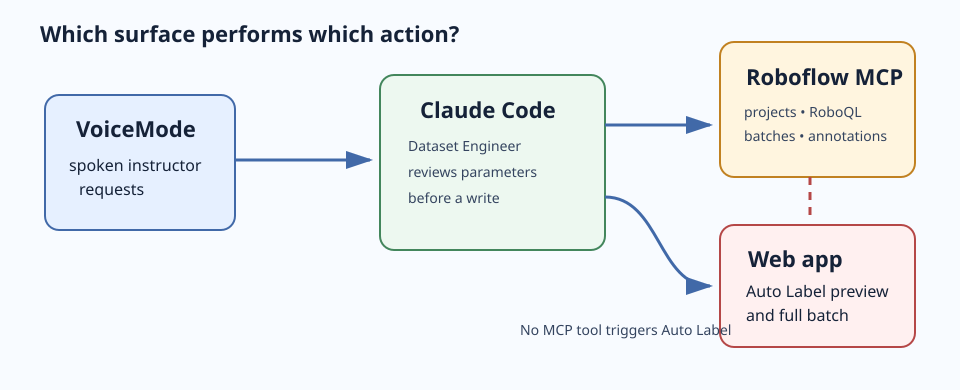
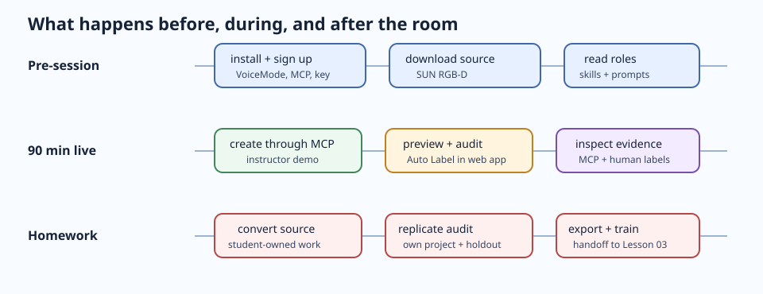
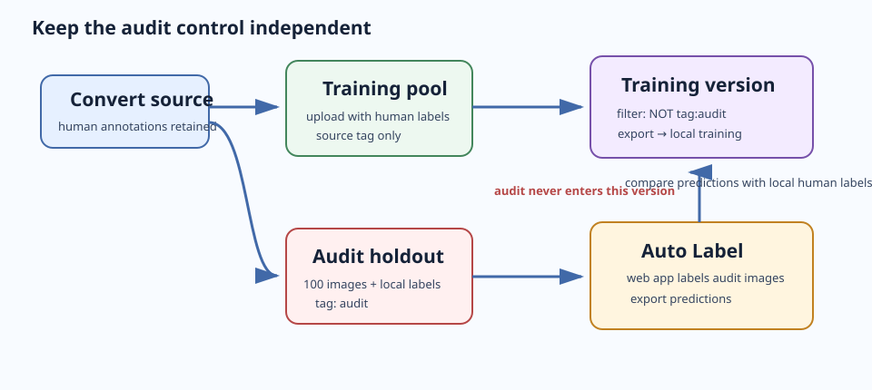

# Lesson 02 — Dataset Engineering: MCP, controls, and Auto Label

> Notion Week 2. **Live session: 90 minutes.** Observe the demonstration through
> Claude Code's `/voicemode:converse`, then complete conversion, uploads, and the full
> workflow in your own project after class.

## Session goal

Use a live, metered computer-vision platform without confusing an agent action, a web-app
action, and a result that counts as evidence. During the demonstration, you will inspect
a prepared source dataset and a disjoint, human-labelled 100-image audit holdout. You
will later choose **one** source—SUN RGB-D or NYU Depth V2—convert it yourself, and
reproduce the workflow in your own project.

The lesson has two boundaries:

| Boundary | Rule |
|---|---|
| Agent authority | Claude Code may create and inspect platform state through MCP only after you review its parameters. |
| Evidence | Auto Label predictions are compared with local human labels; audit images never enter the training version. |



The existing [Roboflow MCP workflow](resources/images/roboflow-mcp-workflow.png) explains
how Claude Code reaches the platform. The diagram above adds the boundary that matters
today: there is no `auto_label` MCP tool. MCP can create projects, query images and
batches, and save an annotation; the Roboflow web app runs the Auto Label preview and
full batch.

### Session budget — 90 minutes

| Step | Time |
|---|---:|
| 1. Observe the VoiceMode demonstration | 8 min |
| 2. Observe project creation through MCP | 10 min |
| 3. Inspect the prepared source and audit control | 12 min |
| 4. Predict Auto Label failures | 8 min |
| 5. Observe the free four-image preview | 12 min |
| 6. Observe the estimate and 100-image audit | 10 min |
| 7. Observe results and one isolated MCP write | 15 min |
| 8. Observe the comparison with human labels | 10 min |
| 9. Confirm your source track and reconcile | 5 min |
| **Total** | **90 min** |

**Cut lines, in order:** shorten step 4 first, then shorten the discussion in step 8.
Never cut project creation, the MCP-versus-web-app distinction, or the human-label
comparison.



## Prerequisites

### Pre-session homework — complete before class

Do this on your own machine. These tasks are long-running or platform-sensitive and do
not belong in the room.

- [ ] Install Claude Code and VoiceMode; verify one short spoken exchange.
- [ ] Install/connect the Roboflow plugin or MCP server; confirm `/mcp` reports it
      connected.
- [ ] Create a Roboflow account and a personal API key. Start Claude Code from a shell
      where `ROBOFLOW_API_KEY` and `ROBOFLOW_WORKSPACE` are available. Never commit the
      key or a `.env` file.
- [ ] Read `.claude/agents/dataset-engineer.md` and `.claude/agents/data-pipeline.md`,
      then the Roboflow data-management, labeling, and plans-and-pricing skills.
- [ ] Choose and download the raw source files for **one** track:
  - **SUN RGB-D** — MATLAB metadata with source boxes.
  - **NYU Depth V2** — HDF5 instance/class data from which you derive boxes.
- [ ] Read the matching converter prompt—
      [SUN RGB-D](resources/prompts/01-sunrgbd-converter.md) or
      [NYU Depth V2](resources/prompts/05-nyu-converter.md)—plus the
      [dataset-version](resources/prompts/02-dataset-version.md),
      [annotation-review](resources/prompts/03-annotation-review.md), and
      [Auto Label audit](resources/prompts/04-autolabel-audit.md) prompts. Do not
      convert, create a personal project, or upload images yet.

**Do:** Verify the two tools in the project you will use.

```text
/mcp
/voicemode:converse
```

**Expected result:** Roboflow is connected and VoiceMode completes a short spoken
exchange. If either check fails, observe the live fallback during class and repair the
problem before starting post-session replication.

## Deliverables

### From the session

- [ ] An object-detection project created during the demonstration and confirmed through MCP
- [ ] MCP evidence that the prepared audit batch contains exactly 100 `audit` images
- [ ] Your prediction recorded before the Auto Label preview
- [ ] A free four-image Auto Label preview and one 100-image audit
- [ ] A pre-operation estimate and post-operation reconciliation in the credit ledger
- [ ] One controlled `annotations_save` action only on the `mcp-demo` image
- [ ] A per-class comparison of Auto Label predictions and local human labels
- [ ] Your selected track recorded: SUN RGB-D or NYU Depth V2

### From post-session homework

- [ ] Your converter, conversion report, and pixel-level annotation check
- [ ] Your own project, source tag, 100-image local human-labelled holdout, and verified
      export at `data/v<N>/`
- [ ] Your four-image preview, 100-image Auto Label audit, and comparison report
- [ ] A dataset card that states source, conversion provenance, actual version number,
      audit result, and known limitations
- [ ] A reconciled ledger with no dataset files, secrets, or model artifacts staged

The next lesson uses your verified export for local training. You do not need both
datasets or a second version to complete this lesson.

## Step-by-step

## Part 1 — In session (90 minutes)

### 1. Observe the VoiceMode demonstration — 8 minutes

**Do:** Watch the live demonstration begin in VoiceMode. Record the two boundaries from
the session goal: “MCP can inspect and write annotations. It cannot start Auto Label.”

```text
/voicemode:converse
```

**Expected result:** you can explain why an agent that used `annotations_save` must not
claim it ran Auto Label.

### 2. Observe project creation through MCP — 10 minutes

**Do:** Observe the Dataset Engineer display the project parameters before anything is
created. In the demonstration prompt, `<workspace>` is the demonstration workspace slug
and `<cohort>` is the session's unique short identifier.

```text
Use the dataset-engineer agent. In workspace <workspace>, show the exact parameters for a
new project named smart-scene-analyzer-demo-<cohort>, type Object Detection, annotation
group object. Do not call projects_create until I approve the displayed parameters.
```

**Do:** Watch the approval after the type and name have been reviewed:

```text
Create the approved project. Then use projects_get or projects_list to report the project
ID, project type, and class state. Do not change anything else.
```

**Expected result:** MCP confirms a new object-detection project. The review comes first
because project type cannot be changed after creation.

### 3. Inspect the prepared source and audit control — 12 minutes

**Do:** Observe the inspection of the prepared project. Its training pool has human
labels; its 100 audit images are unlabelled in Roboflow and tagged `audit`; the matching
human-label files are local only.

```text
Use images_search with RoboQL in project <fallback-project-id>. Report counts for tag:audit
and NOT tag:audit. Then use annotation_batches_list and annotation_batches_get to report
the audit batch ID, image count, and annotation state. Do not modify annotations.
```

In the demonstration, `<fallback-project-id>` is the prepared project's ID.

**Expected result:** `tag:audit` returns 100 images and the batch count agrees. If either
count differs, note the problem before the demonstration continues.



**Do:** Observe the agent explain the protection without generating a version.

```text
Explain why tag:audit must be excluded from a training version and show how versions_get
would verify that exclusion. Do not generate or export a version.
```

**Expected result:** you can explain why an audit sample that entered training cannot be
used as independent evidence.

### 4. Predict Auto Label failures — 8 minutes

**Do:** Observe the Dataset Engineer read the prepared project taxonomy and propose a
prediction for each class before the preview. Record your own prediction before seeing
the output.

```text
Read the project taxonomy. For every class, predict whether a foundation-model Auto
Labeler will be reliable, fuzzy, or hard on indoor images, with one visual reason. Do not
run inference and do not modify the project.
```

**Expected result:** you record a falsifiable prediction before seeing output.

### 5. Observe the free four-image preview — 12 minutes

**Do:** Watch the `audit` batch open in the Roboflow web app. Observe **Auto Label** run
on four images with the taxonomy classes and descriptions, then inspect the boxes before
the names, descriptions, or per-class confidence change.

**Expected result:** four results are visible. Name one false positive, false negative, or
box-convention disagreement. This is a free **web-app** action, not an MCP call.

### 6. Observe the estimate and 100-image audit — 10 minutes

**Do:** Observe the estimate being recorded in the demonstration `docs/credit-budget.md`
ledger before the full operation, then record the estimate in your session notes.

```text
Auto Label 100 images at the current published rate. Estimate: 1 credit. Remaining before
operation: <balance>. Record the estimate in the credit ledger before approval.
```

In the demonstration, `<balance>` is the account's current balance.

**Do:** After approval, observe **Auto Label with This Model** run in the Roboflow web app
for the complete audit batch.

**Expected result:** the batch is labelled and the ledger records the estimate before the
spend. No personal account is charged during the demonstration.

### 7. Observe the result and one isolated MCP write — 15 minutes

**Do:** Observe the audit state being queried without changes.

```text
Use annotation_batches_get and images_search to report the audit batch annotation state and
three example image IDs. Do not access or modify any image tagged audit.
```

**Expected result:** the agent reports live platform state and does not claim it triggered
Auto Label.

**Do:** Observe an MCP write only on the separate `mcp-demo` image.

```text
For the single image tagged mcp-demo, show the annotations_save payload for one bounding
box, including its class and coordinate format. Wait for approval. After approval, save it
only on that image, retrieve the image, and confirm the result. Do not touch tag:audit.
```

**Expected result:** you see one read → approve → write → verify cycle, while audit data
remains unchanged.

### 8. Observe the comparison with human labels — 10 minutes

**Do:** Observe the audit annotations being exported and compared with the local
human-label directory used for the demonstration.

```bash
uv run python scripts/compare_autolabel.py <audit-export-directory> <human-label-directory> --report
```

Replace `<audit-export-directory>` with the exported Auto Label data directory and
`<human-label-directory>` with the demonstration's local audit ground truth.

**Expected result:** the report shows per-class precision, recall, and IoU-matched
agreement. Open at least one disagreement before deciding whether it is a model failure or
a different human box convention.

### 9. Confirm your source track and reconcile — 5 minutes

**Do:** Confirm the track you downloaded before class.

| Track | You will do in homework | Why it differs |
|---|---|---|
| **SUN RGB-D** | Convert MATLAB metadata to the shared taxonomy | Source annotations already include boxes. |
| **NYU Depth V2** | Derive boxes from HDF5 instance/class maps | Conversion is harder and must handle array orientation. |

**Do:** Observe the reconciliation of the demonstration's actual usage.

```text
Open app.roboflow.com/<workspace>/settings/usage. Compare actual spend with the estimate in
docs/credit-budget.md, then update Remaining and Last reconciled.
```

**Expected result:** the demonstration ledger contains estimated and actual audit spend,
and your chosen source is recorded.

## Part 2 — Post-session homework: replicate in your own project

Do these in order. Each later step relies on the control created by the earlier one.

### H1. Convert the source you downloaded

**Do:** Use the matching converter prompt:
[01-sunrgbd-converter.md](resources/prompts/01-sunrgbd-converter.md) for SUN RGB-D or
[05-nyu-converter.md](resources/prompts/05-nyu-converter.md) for NYU Depth V2. Inspect,
convert, and verify labels against pixels before uploading.

**Expected result:** you have a conversion report, images, labels, and a disjoint
`data/audit-gt/` directory containing 100 images with local human annotations.

### H2. Create and inspect your own project

**Do:** Repeat the parameter-review/create sequence from step 2 in your own workspace,
then verify the result through MCP.

```text
Use projects_get to report the ID and type of my smart-scene-analyzer project. Do not modify
the project.
```

**Expected result:** you know the actual project ID and have recorded it in
`docs/credit-budget.md`.

### H3. Upload, tag, and protect the control

**Do:** Upload the converted training pool with its human labels. Tag every training image
with your source tag—`sun-rgbd` or `nyu-v2`—then upload the audit **images only** and tag
them `audit`. Keep the human labels in `data/audit-gt/`.

**Expected result:** MCP count queries confirm the source tag and exactly 100 `audit`
images. Generate/export a version filtered with `NOT tag:audit`.

### H4. Verify the export

**Do:** Copy the Lesson 02 verification helper into your student project, then run it on
the actual version directory.

```bash
cp <path-to-course-repo>/lessons/02-dataset-engineering/resources/scripts/verify_export.py scripts/
uv run python scripts/verify_export.py data/v<N> --taxonomy docs/taxonomy.md
```

Replace `<path-to-course-repo>` with the absolute path to this course repository and `<N>`
with the real immutable Roboflow version number.

**Expected result:** the export passes and `data/v<N>/` contains train, valid, and test
splits. The audit images are not in the export.

### H5. Reproduce the Auto Label audit

**Do:** Follow [04-autolabel-audit.md](resources/prompts/04-autolabel-audit.md): run the
free four-image preview first, record the 100-image estimate before approval, run Auto
Label in the web app, export its predictions, and compare them with `data/audit-gt/`.

**Expected result:** your dataset card records the class prompts, per-class agreement, a
credit estimate/actual, and known disagreements. If you cannot spend the credit, record
“not run” and why; do not fabricate an audit result.

### H6. Hand off a verified dataset to Lesson 03

**Do:** Update the dataset card, reconcile the ledger, and commit only source-controlled
work.

```bash
git status --porcelain | grep -E '\.pt$|mlflow\.db|^\\?\\? data/|\.env$' && echo "LEAK" || echo "clean"
```

**Expected result:** the command prints `clean`. Your next task is Lesson 03 local
training on the verified export, not a new dataset conversion.

## Verification

### Session checks

- You reviewed the displayed project parameters before `projects_create`.
- `tag:audit` returned 100 images and the annotation-batch count matched.
- The preview and full Auto Label operation were identified as web-app actions.
- The ledger contains the estimate before spend and the actual charge after reconciliation.
- `annotations_save` affected only `mcp-demo`, never `audit`.
- You inspected an image-level disagreement in the comparison output.

### Homework checks

```bash
# Verify the selected immutable export.
uv run python scripts/verify_export.py data/v<N> --taxonomy docs/taxonomy.md

# Confirm no data or secret is staged for commit.
git status --porcelain | grep -E '\.pt$|mlflow\.db|^\?\? data/|\.env$' && echo "LEAK" || echo "clean"
```

Replace `<N>` with your actual version number. The final command must print `clean`.

Then confirm by reading your dataset card:

- It names exactly one source track, source tag, and Roboflow version number.
- It records conversion provenance and a pixel-level validation.
- It says whether the 100-image audit was run and names its label prompts.
- It states that audit images were excluded from the training version.
- It distinguishes Auto Label agreement with human labels from model accuracy.

## Open items

There are no open decisions required to complete the lesson. Before you run your own
Auto Label audit, verify current Roboflow plan visibility and pricing; record any changed
rate in your ledger rather than silently reusing the one-credit estimate.

## Further reading

Local, checked source material:

- `computer-vision-skills/skills/data-management/SKILL.md` — projects, tags, RoboQL,
  immutable versions, and MCP tool coverage.
- `computer-vision-skills/skills/data-management/labeling.md` — Auto Label and
  annotation-batch capabilities.
- `computer-vision-skills/skills/plans-and-pricing/SKILL.md` — current credit-rate
  guidance.

External documentation, checked **2026-08-31**:

- [Claude Code — Connect Claude Code to tools via MCP](https://code.claude.com/docs/en/mcp)
- [Claude Code — Configure permissions](https://code.claude.com/docs/en/permissions)
- [VoiceMode — installation and Claude Code plugin path](https://github.com/mbailey/voicemode#readme)
- [Roboflow credits](https://roboflow.com/credits)

**Previous:** [Lesson 01](../01-project-definition-and-system-design/) ·
**Next:** [Lesson 03 — Model Development](../03-model-development/)
