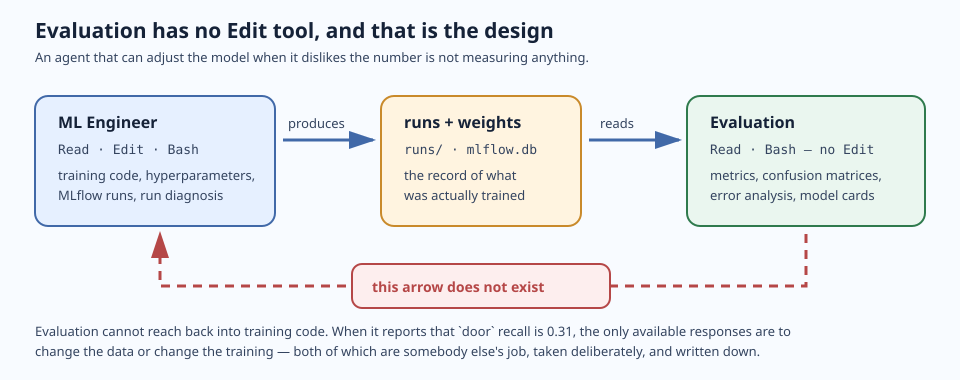
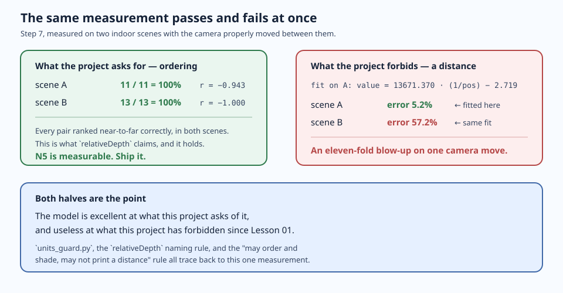

# Lesson 03 — Model Development

> Notion Week 3. **Session: 90 minutes.** Homework: 2–3 hours, most of it unattended
> while training runs.

## Session goal

Turn a dataset into a model you have looked at with your own eyes, and a depth channel
that says exactly what it means.

The engineering content is **where computation happens and who decides**. Lesson 02
connected the harness to a live platform; this session connects it to a live platform
that charges by the minute. Training is the first operation in this course that can
consume your entire remaining budget in a single call, and the agent proposing it will do
so with complete confidence.

So this lesson runs local-first. You fine-tune YOLO11 on your machine for free, iterate as
much as you like, and spend credits exactly twice: never, if you use the free platform
path, and once — deliberately, behind a permission prompt you wrote yourself in Lesson 02
— on a hosted run whose purpose is comparison rather than production.

By the end of the **session** you have a depth module whose signatures cannot be misread,
both models running together on your own camera, and a demonstration of why depth in this
project can be ranked and never measured. By the end of the **homework** you have a trained
model, per-class metrics you have read rather than skimmed, and a card that says what the
model is not for.

### ⚠️ Session budget — 90 minutes, and it is a constraint on the lesson, not on you

**Waiting is not teaching.** Anything whose dominant cost is elapsed time — a training
run, a hyperparameter sweep, a long evaluation — is homework. The session keeps what needs
a room: decisions with real trade-offs, and the harness blocking you.

| | Budget |
|---|---|
| 1. Meet the two new roles | 5 min |
| 2. Choose the architecture — and override the skill | 10 min |
| 3. Stand up MLflow, and start V1 training in the background | 10 min |
| 4. Depth Anything V2 — inference only | 20 min |
| 5. Prove the sign convention | 5 min |
| 6. Both models, on your own camera | 20 min |
| 7. Reference Depth Calibration | 15 min |
| 8. Reconcile, and hand off to homework | 5 min |
| **Total** | **90 min** |

> **If you are running behind, cut step 2 to the punchline and keep steps 6 and 7.** The
> architecture override is a story you can read; the camera and the calibration are the
> two things that do not work as reading.

## Prerequisites

Seven steps, **in this order**, and steps 4 and 5 are the ones that must not wait for the
room: both download model weights, and a first download inside a 90-minute session is
twenty minutes nobody gets back. Budget 30 minutes plus the downloads.

**1. Finish Lesson 02.** You need a dataset version exported and passing
`verify_export.py`, and a reconciled ledger.

```bash
uv run python scripts/verify_export.py data/v<N> --taxonomy docs/taxonomy.md
grep -A2 'Remaining' docs/credit-budget.md
```

**Expected result:** the verifier exits 0, and **Remaining is at least 3.0**. Below that,
decide now whether you are skipping the hosted run in H5 — it is the only billed step in
this lesson.

**2. Confirm the training gate is armed.** This lesson makes the first call that can spend
your whole remaining budget at once.

```bash
grep -n 'trainings_create' .claude/settings.json
```

**Expected result:** `trainings_create` appears under `ask`, in both the
`mcp__roboflow__` and `mcp__plugin_roboflow_roboflow__` spellings.

**3. Install the training and depth dependencies.**

```bash
uv sync --extra ml --extra depth
```

**Expected result:** exit code 0. This pulls `torch`, `ultralytics`, `mlflow`,
`transformers`, and `timm` — the largest dependency tree in the course and the most
platform-sensitive. If it fails, you have a retry rather than a blocked session.

**4. Download the detection weights.** Ultralytics fetches `yolo11n.pt` the first time a
model is constructed; do that now rather than at minute 20 of the session.

```bash
uv run python -c "from ultralytics import YOLO; YOLO('yolo11n.pt'); print('yolo11n cached')"
```

**Expected result:** `yolo11n cached`, and `yolo11n.pt` on disk. Confirm it is gitignored —
`*.pt` is in the scaffold's `.gitignore`, and weights are not source.

**5. Download the depth weights.** Step 4 of the session runs Depth Anything V2 Small
through `transformers`, which fetches from the Hugging Face Hub on first use.

```bash
uv run python -c "
from transformers import pipeline
pipe = pipeline('depth-estimation', model='depth-anything/Depth-Anything-V2-Small-hf')
print('depth weights cached')"
```

**Expected result:** `depth weights cached`. The checkpoint is ~25M parameters — small, but
it is still a network round trip you do not want live. Model id verified against
<https://huggingface.co/depth-anything/Depth-Anything-V2-Small-hf>, checked **2026-09-09**.

**6. Have a camera ready, or a photo instead.** Steps 6 and 7 put both models on a frame
you captured yourself.

**Expected result:** a working webcam, **or** a photo of a room with at least two objects
at clearly different distances. No webcam is survivable — `check_live_capture.py` and
`check_reference_depth.py` both accept `--image` — but you lose the part students remember.

**7. Read `.claude/agents/ml-engineer.md` and `.claude/agents/evaluation.md`.** Step 1
introduces both roles. Knowing before you arrive that Evaluation has no `Edit` tool is the
difference between the constraint landing and it being a detail.

A GPU is *helpful* but not required — training is homework, so it runs while you sleep.

> **This lesson refers to your dataset version by number, never as "the latest".** The
> examples below use `data/v1/`, which is what Lesson 02 produces. If yours is numbered
> differently, substitute — and fix the reference rather than remembering the difference.

## Deliverables

### From the session

- [ ] `.claude/agents/ml-engineer.md` and `evaluation.md` in use
- [ ] `docs/decisions/` — an ADR for the detection architecture (YOLO11, and why not RF-DETR)
- [ ] A local MLflow tracking server, with a V1 run started
- [ ] `src/smart_scene_analyzer/depth.py` — Depth Anything V2 inference, units stated
- [ ] The ordering check passing on real scenes, and a depth map you have looked at
- [ ] `docs/live-validation.md` — both models on a frame from your own camera
- [ ] A Reference Depth Calibration result, including the transfer test

### From the homework

- [ ] `scripts/train.py` — parameterized by dataset version, logging to MLflow
- [ ] **Model V1**, with per-class metrics on the test split
- [ ] `docs/evaluation-v1.md` — the error analysis
- [ ] `tests/test_depth.py` — the offline suite for the depth module
- [ ] N5 measured over the test split
- [ ] `docs/model-card-v1.md`
- [ ] The ledger updated and reconciled

Verify with [`resources/checklists/deliverables.md`](resources/checklists/deliverables.md).

---

## Step-by-step

## Part 1 — In session

### 1. Meet the two new roles



**Do:** Read both definitions. They shipped with the Lesson 01 scaffold and have been
unused until now.

```bash
$EDITOR .claude/agents/ml-engineer.md .claude/agents/evaluation.md
```

Compare their `tools` lines:

```yaml
# ml-engineer
tools: Read, Grep, Glob, Write, Edit, Bash, Skill, mcp__roboflow__*

# evaluation
tools: Read, Grep, Glob, Write, Bash, Skill
```

**The Evaluation Agent has no `Edit`.** It can write reports; it cannot modify training
code. That is the whole design.

An agent that both trains the model and reports whether the model is good has an incentive
problem, and it does not need to be malicious to act on it — asked to "improve the
results", the shortest path is to adjust the threshold, or evaluate on the train split, or
quietly drop the class that was dragging the average down. None of those are lies. All of
them produce a better number and a worse model.

Splitting the roles removes the shortcut. The Evaluation Agent cannot change what it
measures, so its only way to produce a better number is for the number to be better.

> This generalizes past this project. When you give an agent a goal and the tools to reach
> it, check whether any of those tools reach the goal *without* doing the work. That is
> where harness design earns its keep.

**Expected result:** you can state why `evaluation` lacks `Edit` without rereading this.

---

### 2. Choose the architecture — and override the skill


**Do:** Ask the ML Engineer what Roboflow recommends, and notice that it disagrees with
this course.

```
Read roboflow:training-and-evaluation. What architecture does it recommend for a
non-COCO indoor object detection dataset of ~1,500 images, and what does its decision
tree say at step 14? Give me the exact model_id values. Do not start any training.
```

**Expected result:** the agent reports the decision tree's recommendation — **RF-DETR NAS**
(`rfdetr-nas-parent`), falling back to `rfdetr-medium`. Not YOLO11.

That is a real conflict and it is worth understanding rather than papering over. The skill
is not out of date and it is not wrong. It optimizes for accuracy on Roboflow's platform,
where NAS genuinely does produce the best model.

**This course chooses YOLO11 anyway**, for reasons the skill has no way to know: the
artifact has to run on a handset, a NAS run trains dozens of child models over hours at 2
credits/hour against a 20-credit lifetime budget, and NAS fails outright on non-Core plans.

**Do:** Record it — `/adr detection architecture: YOLO11 over RF-DETR`. The ADR must state
what the skill recommends, why you departed, **and what the departure costs**.

> **The punchline, if you are short on time:** a vendor skill encodes the vendor's
> defaults, and the vendor does not know your budget or your target device. Overriding one
> is normal. Overriding one *without recording why* is how a project forgets its own
> constraints.

---

### 3. Stand up MLflow, and start V1 training in the background

**Do:** Start a local tracking server. This costs nothing and runs on your machine.

```bash
uv run mlflow server --host 127.0.0.1 --port 5000 --backend-store-uri sqlite:///mlflow.db
```

In another shell:

```bash
export MLFLOW_TRACKING_URI=http://127.0.0.1:5000
```

Add it to `.env` as well. Then confirm:

```bash
uv run python -c "import mlflow, os; mlflow.set_tracking_uri(os.environ['MLFLOW_TRACKING_URI']); print(mlflow.search_experiments())"
```

**Expected result:** the command prints a list (the Default experiment) without erroring,
and `http://127.0.0.1:5000` loads in a browser.

**Do:** Confirm `mlflow.db` and `mlruns/` are gitignored. Tracking data is not source.

**Do:** Use [`resources/prompts/01-local-training.md`](resources/prompts/01-local-training.md)
to have the ML Engineer write `scripts/train.py`, then **start a run now so it trains while
you do the rest of the session**:

```bash
uv run python scripts/train.py --data data/v1/data.yaml --model yolo11n.pt --epochs 50 --name v1-baseline
```

**Expected result:** a run appears in the MLflow UI and starts logging. You will read its
results in the homework, not now.

> Lesson 01 left MLflow hosting as an ⚠️ OPEN decision. Local SQLite is the answer for a
> course-scale project: zero cost, zero setup, every run reproducible on one machine.
> Record it — `/adr mlflow hosting: local sqlite` — and note the consequence, which is that
> runs are not shared across machines. Lesson 06 revisits this when CI needs to see them.

---

### 4. Depth Anything V2 — inference only

**Do:** Use [`resources/prompts/04-depth-inference.md`](resources/prompts/04-depth-inference.md)
to have the ML Engineer write `src/smart_scene_analyzer/depth.py`.

Runs locally through `transformers`. **Zero credits, and no training** — this is a
pretrained model you run, not one you fine-tune.

**The deliverable here is the units, not the code.** The inference call is about fifteen
lines. The module that cannot be misread downstream is the exercise.


> Depth Anything V2 outputs **relative inverse depth**. Larger values are nearer. The scale
> is arbitrary and it is **not a distance in any unit**. With no scale to calibrate
> against, the relative units travel all the way to the screen.

A function called `estimate_depth` returning an array called `depth` is ambiguous and
therefore wrong. `estimate_relative_inverse_depth` is right. `CLAUDE.md` has demanded this
since Lesson 01 — "Ambiguity about whether a depth value is metres or normalized disparity
is a real source of bugs in this project" — and this is where the demand becomes concrete.

#### ⚠️ The hook will block you, and it will be right

`units_guard.py` greps the **entire file**, not just identifiers. The natural sentence for
"this is not measured in metres" contains the word it blocks — so writing the docstring
that denies the claim gets the write refused.

**That is the hook working.** It cannot read intent, and a rule that let a denial through
would let every plausible-looking violation through with a denial bolted on.

**Do not edit the hook, and do not route around it.** Satisfy it. `Not a distance, in any
unit.` says the same thing and passes. This is the lesson's own rule — *if a hook blocks
you, satisfy it or stop* — with a worked example attached.

> Notice which layer of the harness caught this. `CLAUDE.md` has stated the rule for three
> lessons. The rule was correct, prominent, and loaded into every session — and it is
> *advice*, competing with a plausible-looking identifier at the moment of writing. The
> hook does not compete with anything.

**Expected result:** `depth.py` with `estimate_relative_inverse_depth` and
`region_relative_depth`, every degenerate box case defined, and the model cached rather
than loaded per call.

---

### 5. Prove the sign convention

An inverted sign convention produces output that looks entirely reasonable. Every value is
in range, the map has structure, the visualization looks like a depth map. It is simply
backwards, and nothing downstream will tell you.


**Do:** Copy the checker in, then run it on scenes where you can see which object is nearer.

```bash
cp <path-to-course-repo>/lessons/03-model-development/resources/scripts/check_depth_ordering.py scripts/
```

Give it two or more boxes, **nearest first**:

```bash
uv run python scripts/check_depth_ordering.py <image>.jpg \
  --box 20,270,550,438 --box 195,84,586,251 --render /tmp/depth.png
```

Or put several scenes in one file and run them together:

```bash
uv run python scripts/check_depth_ordering.py --cases cases.json
```

```json
[
  {"image": "data/v1/test/images/<file>.jpg", "boxes_near_to_far": [[20,270,550,438], [195,84,586,251]]}
]
```

#### A worked example, if you have no scene of your own yet

[`resources/images/sign-check-street-scene.jpg`](resources/images/sign-check-street-scene.jpg)
— **2000 × 1330**, five subjects at obviously different distances. Boxes are absolute
pixels, nearest first:

| # | `x1,y1,x2,y2` | What it is |
|---|---|---|
| 1 | `1600,1180,1990,1325` | White car, bottom-right corner |
| 2 | `1400,1035,1620,1190` | Silver car behind it |
| 3 | `1500,730,1840,1040` | Red double-decker bus |
| 4 | `960,945,1090,1050` | Black SUV, mid-road |
| 5 | `215,150,335,490` | Tower on the horizon |

Two boxes prove the sign. Five also prove the map has not collapsed flat — an ordering
that holds at the extremes and fails in the middle is a different bug, and this is the
cheapest place to see it.

> Coordinates are tied to this file at this size. Resize or crop it and they are wrong.
> Box 5 includes sky, which reads as farthest anyway; drop it if the row looks odd.

**Expected result:** every case ordered correctly, exit 0. A row reading `none` means that
box reduced to `None` — a degenerate case from step 4, not a crash.

**Do:** Open `/tmp/depth.png` and look at it. **Nearer surfaces must be brighter.** This
takes thirty seconds and catches what the numbers will not: a map that is structurally
wrong rather than merely inverted.

---

### 6. Both models, on your own camera

**Do:** Use [`resources/prompts/05-live-validation.md`](resources/prompts/05-live-validation.md).

```bash
cp <path-to-course-repo>/lessons/03-model-development/resources/scripts/check_live_capture.py scripts/
uv run python scripts/check_live_capture.py --camera 0
```

No webcam? `--image <some-photo>.jpg` works identically.

This is the first time detection and depth run on **the same pixels** and produce one
answer. That fusion is the product, and Lesson 04 exports it.

Every number so far came from the test split — same sensor family, same kind of room, same
annotation process. That is a comfortable place to be wrong. Your desk is not.

**Expected result:** two PNGs and a near-to-far table. **Open both PNGs.** Then answer two
questions no metric in this lesson answers:

1. **Are the boxes on the right things, and what is missing?**
2. **Is the near-to-far order right?**

You are running COCO-pretrained weights, which know five of this project's eight classes
under their own names — and `cabinet`, `door`, and `lamp` not at all:

| ours | `bed` | `chair` | `sofa` | `table` | `tv` | `cabinet` | `door` | `lamp` |
|---|---|---|---|---|---|---|---|---|
| COCO | `bed` | `chair` | `couch` | `dining table` | `tv` | — | — | — |

**That gap is the argument for fine-tuning**, and watching your own desk come back
half-labelled makes it better than a mAP table does.

> The script writes files and never opens a window. The project depends on
> `opencv-python-headless`, which has no GUI backend — a deliberate dependency choice, and
> one fewer platform-specific thing to break in a classroom.

---

### 7. Reference Depth Calibration

**Do:** Use [`resources/prompts/06-reference-depth.md`](resources/prompts/06-reference-depth.md).

**What this is:** calibration in the metrology sense — checking an instrument against a
reference you trust. You place objects at positions you measured, photograph them, and find
out what the model's numbers track.

**What it is not:** deriving a conversion from model output to a distance. That is
impossible here, and **demonstrating the impossibility is the exercise.**

This lesson has been asserting since step 4 that the scale is arbitrary. Asserting is weak.
Now you fit a conversion, watch it work beautifully on the scene it was fitted to, apply it
to a second scene, and watch it fall apart.

```bash
cp <path-to-course-repo>/lessons/03-model-development/resources/scripts/check_reference_depth.py scripts/
uv run python scripts/check_reference_depth.py --cases reference_scenes.json --transfer
```

Build **two genuinely different scenes**, three to five objects each, spread out, with the
camera properly moved between them. Measure positions however you like — **the script uses
only the order and the ratios, and never converts them, so no unit enters the project.**



**Expected result**, and a real one, from two indoor scenes:

```
scene A                 ordering 11/11 = 100%    rank correlation -0.943
scene B                 ordering 13/13 = 100%    rank correlation -1.000

fit on A:  value = 13671.370 * (1/position) + -2.719
  scene A error   5.2%   <- fitted here
  scene B error  57.2%
```

**Perfect ordering. An eleven-fold blow-up in the fit.** Both halves are the point: the
model is excellent at what this project asks of it, and useless at what this project has
forbidden since Lesson 01. The `units_guard` hook, the `relativeDepth` naming rule, and the
"may order and shade, may not print a distance" rule in `CLAUDE.md` all trace back to this
one measurement, and now you have taken it yourself.

> **If your two transfer errors come out similar, you did not move the camera enough.**
> Similar framing at a similar range agrees by coincidence, and a coincidence is not a
> calibration. Move properly and run it again.

---

### 8. Reconcile, and hand off to homework

**Do:**

1. Open `app.roboflow.com/<workspace>/settings/usage`
2. Compare against `docs/credit-budget.md`
3. Update **Remaining** and **Last reconciled**

**Expected result:** spend for this session is **0 credits**. Everything in Part 1 runs
locally.

**Do:** Check on the training run you started in step 3, and read the homework list below
before you leave.

```bash
git add -A
git status          # confirm: no runs/, no *.pt, no mlflow.db, no data/
git commit -m "Lesson 03 session: depth module, live validation, reference calibration"
```

> **Do not commit weights.** `runs/`, `*.pt`, `mlflow.db`, and `mlruns/` all stay out.
> Weights live in MLflow, datasets in Roboflow. If `git status` shows a `.pt` file, fix
> `.gitignore` before committing.

---

## Part 2 — Homework

Roughly 2–3 hours, most of it unattended. **Start H1 the moment you get home** — everything
else depends on it, and it is the part that runs while you do something else.

### H1. Finish V1, then evaluate and diagnose

Let the run from step 3 finish, then hand off to the Evaluation Agent with
[`resources/prompts/02-error-analysis.md`](resources/prompts/02-error-analysis.md).

It computes per-class precision, recall, mAP@50 and mAP@50-95 on the **test split**, builds
a confusion matrix, and reads it through the decision tree in
`roboflow:training-and-evaluation` → `improvement-playbook.md`.

**Now go back to your dataset card.** Every weak class has two candidate explanations, and
they call for opposite responses:

| Symptom | Data explanation | Model explanation |
|---|---|---|
| One class near zero recall | Too few instances — check the card | Underfitting; train longer |
| Two classes confused symmetrically | The taxonomy merged or split things it should not have | Insufficient capacity |
| High precision, low recall everywhere | Confidence threshold too high | Genuine underfitting |
| Good train metrics, poor test | — | Overfitting; more augmentation |

**Most "model problems" in this project are dataset problems**, and the dataset card is what
lets you tell in seconds instead of an afternoon.

> **Roboflow's own evaluation UI is a paid-plan feature.** On the free Public plan you
> compute these locally, which `ultralytics` does natively. No loss for this course; worth
> knowing before you go looking for a tab that is not there.

**Deliverable:** `docs/evaluation-v1.md`.

### H2. Re-run the camera check against your own weights

```bash
uv run python scripts/check_live_capture.py --camera 0 --weights runs/v1-baseline/weights/best.pt
```

Put it beside the annotated image from step 6. The classes COCO could not see should now
appear — and the classes it could see may be *worse*, because 1,500 indoor images is a
narrower world than COCO. Both directions belong in the model card's failure modes.

### H3. Write the depth module's test suite

`.claude/skills/offline-suite` is the procedure. The suite must run with **no GPU, no
network, and no weights on disk** — `depth.py` makes that possible by putting model loading
behind a replaceable seam.

**Verify the offline claim by breaking it, not by reading the code:**

```bash
HF_HOME=$(mktemp -d) HF_HUB_OFFLINE=1 uv run pytest
```

> A marker nobody has exercised is a marker that does not work. Run the deselection
> yourself before you trust it.

**Deliverable:** `tests/test_depth.py`.

### H4. Measure N5 over the test split

Step 7 checked ordering on scenes you built. N5 in `docs/requirements.md` asks for a
**rate** over annotated object pairs on the held-out split, and that needs a reference for
every pair.

**Check what your source dataset actually ships before concluding you cannot.** SUN RGB-D
is an RGB-D dataset — every capture carries a sensor raster next to the RGB frame. Roboflow
does not store depth maps, which is why no depth term can enter training; it does not follow
that no reference exists on disk. Those are two different claims, and conflating them is how
a measurable requirement gets declared impossible.

**Deliverable:** a rate, its conditions, and its margin — declared *before* you compute the
rate, not tuned to it. Use the reference for **ordering only**; no value from it may enter
the project as a magnitude.

### H5. Free and paid platform paths

**Roboflow Instant is free.** Few-shot, detection only, trains in minutes, not competitive
with your fine-tune and not supposed to be.

```
Start a Roboflow Instant training run on dataset version 1. Confirm first that Instant is
free and that this will not consume credits, citing roboflow:training-and-evaluation.
```

Verify your balance is unchanged afterwards. Checking that a "free" operation was free is a
habit worth forming.

<details>
<summary><b>⚠️ Optional: one hosted training run — 2 credits</b></summary>

**Do not run it if you have fewer than 3 credits left.** You lose one comparison row and no
deliverable.

Use [`resources/prompts/03-hosted-training.md`](resources/prompts/03-hosted-training.md).
The agent must state, before calling anything: the `model_id` (`yolov11s`, matching your
local architecture), the epoch count capped so wall time stays under an hour, the arithmetic
(1 credit per 30 minutes → ≤ 2 credits), and your remaining balance.

Then it calls `trainings_create` — and your Lesson 02 permission rule fires. **Stop and read
the prompt.** Record the estimate in the ledger *before* approving, and the actual after.

**On the free Public plan you cannot download the weights.** That is not a footnote: Lesson
04 exports your checkpoint to a file that runs on the handset, and **you cannot export a
checkpoint you cannot download.** The locally trained model is not the cheaper option, it is
the only option that can ship. Keep the hosted run anyway — it is the evidence for that
claim.

| Control | Effect | Billing |
|---|---|---|
| **Cancel Training** | Stops the job, no weights saved | Refund if cancelled early |
| **Early Stopping** | Stops the job, **saves weights** | **Charges for credits used** |

</details>

### H6. Write the model cards

```bash
cp <path-to-course-repo>/lessons/03-model-development/resources/templates/model-card.md docs/model-card-v1.md
```

The Documentation Agent can draft from MLflow run data; **you** write the
known-failure-modes section.

The card records architecture and size, base checkpoint, dataset version *by number*,
hyperparameters, per-class metrics with the split and threshold they were measured at, and
what the model is not for. The Depth section
carries your step 7 result and your H4 rate.

---

## Verification

Work through
[`resources/checklists/deliverables.md`](resources/checklists/deliverables.md).

**Session checks:**

```bash
# The depth sign convention is right — nearest first, at least two boxes
uv run python scripts/check_depth_ordering.py --cases cases.json

# Both models on one frame
uv run python scripts/check_live_capture.py --image <any-photo>.jpg

# The calibration does not transfer, and you can show it
uv run python scripts/check_reference_depth.py --cases reference_scenes.json --transfer

# Nothing large or secret staged
git status --porcelain | grep -E '\.pt$|^\?\? runs/|mlflow\.db|\.env$' && echo "LEAK" || echo "clean"
```

**Homework checks:**

```bash
# Runs exist and are reproducible from their records
uv run python -c "
import mlflow, os
mlflow.set_tracking_uri(os.environ['MLFLOW_TRACKING_URI'])
df = mlflow.search_runs()
print(df[['tags.mlflow.runName', 'params.dataset_version', 'metrics.map50']])
"

# The suite runs with no weights and no network
HF_HOME=$(mktemp -d) HF_HUB_OFFLINE=1 uv run pytest
```

Then confirm by reading:

- Every metric in the model card names its **split, dataset version, and threshold**
- `depth.py` signatures say "relative inverse depth", and no identifier names a unit
- The architecture ADR states what Roboflow's skill recommends and why you departed
- The ledger reconciles, and the hosted run (if any) has an estimate *and* an actual

The qualitative check, and the one this lesson now builds a whole step around: **you looked
at the output.** A model at mAP@50 = 0.55 can be uniformly slightly loose, or excellent on
four classes and blind on two. Those need different responses, and the metric does not
distinguish them.

---

## Open items

- ⚠️ **The depth-scope ADR.** Lesson 02's deliverables ask for it and the model-card
  template assumes it exists. If you did not write it there, write it before H6 — the card
  cites a decision that otherwise lives only in `docs/requirements.md`.
- ⚠️ **N5 has a measured value but no target.** `docs/requirements.md` says how it is
  measured and now what it measured. It still does not say what would be good enough.
- ⚠️ **The `integration` pytest marker is declared but nothing deselects it.** If your
  `pyproject.toml` came from the scaffold, H3's offline run will try to execute integration
  tests. Deselect them yourself and say so in the ADR-free note in your test file.
- ⚠️ **MLflow hosting beyond one machine** (step 3) — local SQLite is decided for now, but
  Lesson 06's CI needs to read runs it did not create. Revisit there.
- ⚠️ **Weight downloads require the Core plan** (H5) — sourced from
  `roboflow:plans-and-pricing`, not confirmed on the platform. This is a hard dependency: if
  free-tier weight download is genuinely impossible, hosted training cannot produce a
  shippable artifact at all.
- ⚠️ **The export toolchain is not installed by this lesson.** Lesson 04 owns export and
  its dependencies are not in `pyproject.toml` yet, so do not assume Lesson 03's
  `uv sync` has prepared you for it.
- ⚠️ **Whether `yolo11n` is sufficient for the taxonomy** — depends on the final class list
  and instance counts. If small classes underperform, the first lever is data, not model
  size.
- ⚠️ **Free-plan credit allowance unconfirmed** — carried from Lesson 02.

All tracked in the course [`TODO.md`](../../TODO.md).

---

## Further reading

Local skill sources, in `computer-vision-skills/skills/`:

- `training-and-evaluation/SKILL.md` — architectures, **exact `model_id` values**,
  checkpoint strategy, training controls, post-training metrics
- `training-and-evaluation/improvement-playbook.md` — the confusion-matrix diagnostic
  decision tree behind H1
- `custom-weights-upload/SKILL.md` — uploading locally trained weights back to Roboflow.
  Note `models_upload_custom_weights` is a **guide, not an uploader** — the MCP server
  cannot read local files, so the actual upload goes through the Python SDK
- `plans-and-pricing/SKILL.md` — training credit rates, and the Core-plan feature list

Project skills:

- `.claude/skills/offline-suite` — the procedure behind H3, including *verify the offline
  claim by breaking it*
- `.claude/skills/error-triage` — the DATA / TAXONOMY / MODEL / EXPORT classification

External, checked **2026-09-09**:

- [Ultralytics YOLO11](https://docs.ultralytics.com/models/yolo11/)
- [Depth Anything V2 — project page](https://depth-anything-v2.github.io/) — **real depth
  maps, at the source.** The diagrams in this lesson are schematics that isolate one idea
  each; go here to see what the model's output actually looks like on real scenes before
  you judge your own
- [`depth-anything/Depth-Anything-V2-Small-hf`](https://huggingface.co/depth-anything/Depth-Anything-V2-Small-hf)
  — the exact checkpoint this lesson and Lesson 04 both use, 24.8M parameters
- [MLflow tracking](https://mlflow.org/docs/latest/tracking.html)

**Previous:** [Lesson 02](../02-dataset-engineering/) ·
**Next:** [Lesson 04 — Export, Quantization & Numerical Parity](../04-backend-engineering/)
