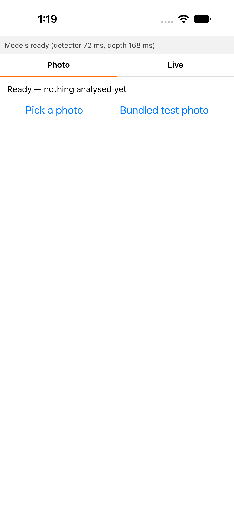
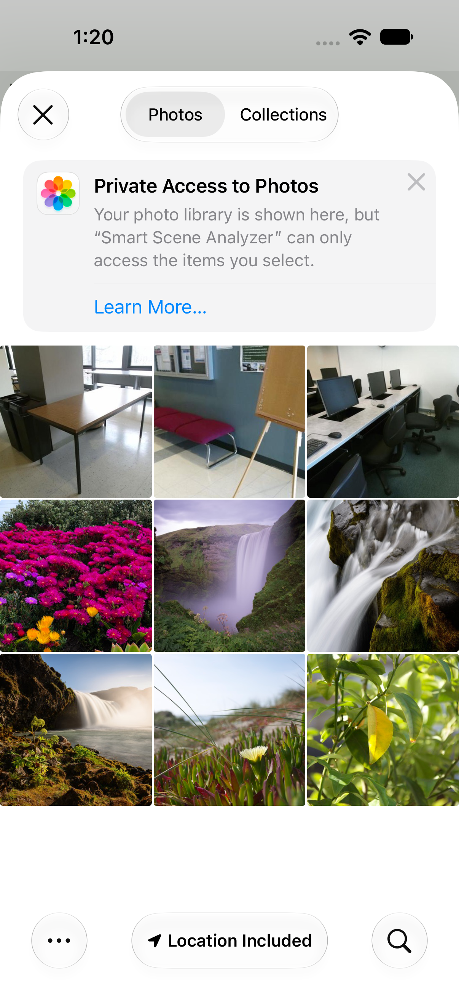
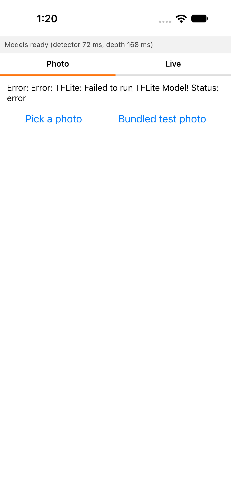
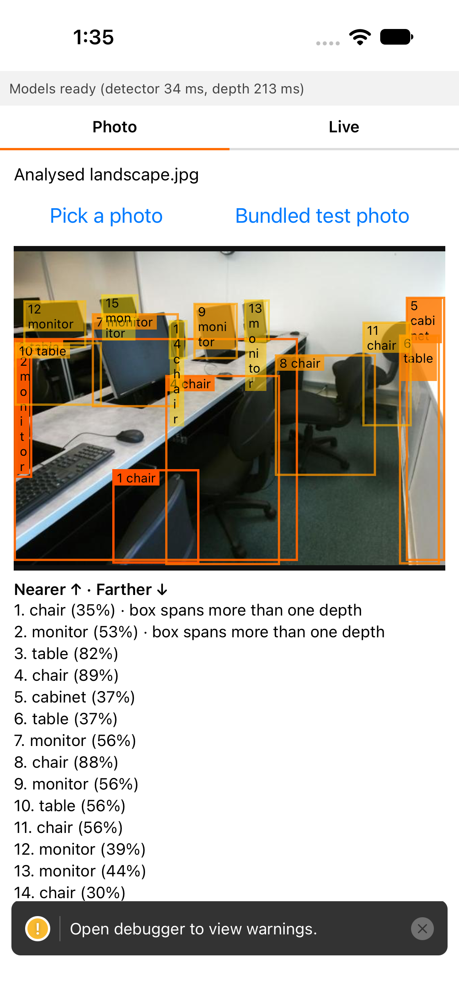
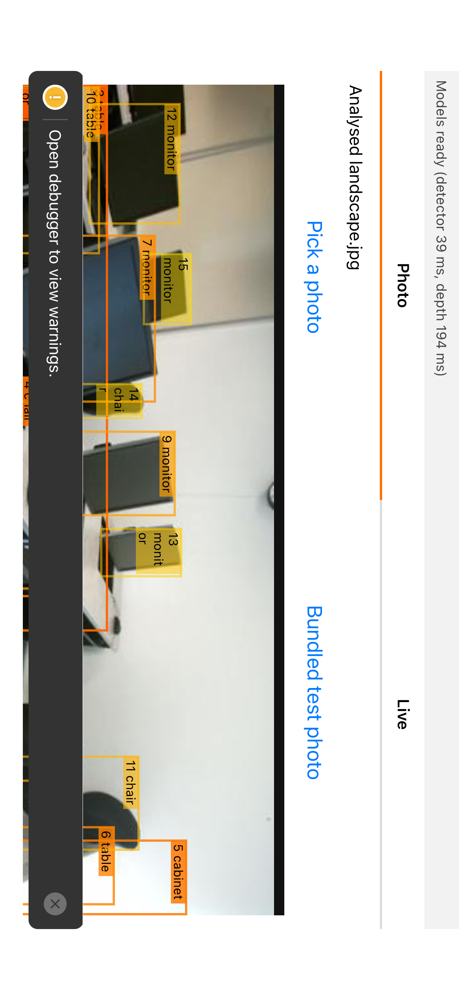
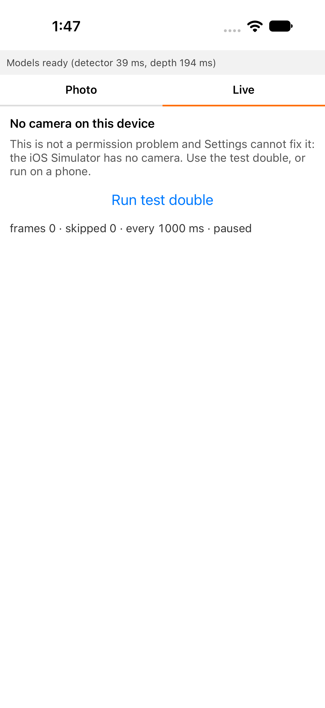
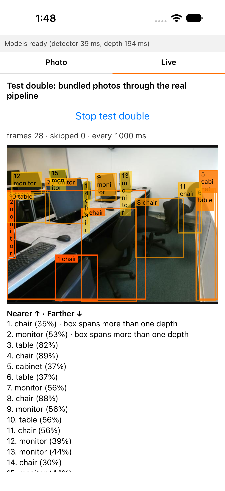
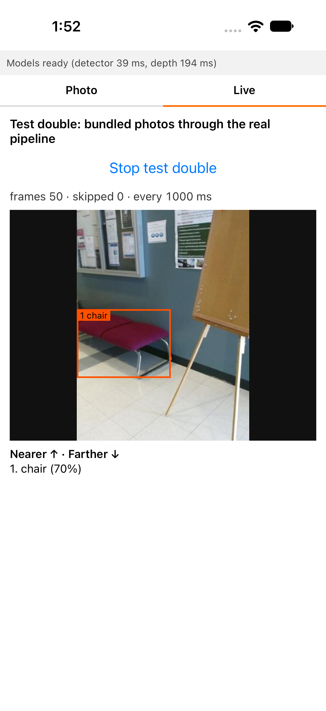

# Lesson 05 — On-Device Inference & Mobile Delivery

> Notion Week 5. **Session: 90 minutes.** Homework: about 1h 40m before, 3h after, plus an
> optional hour putting the app on your own phone.

## Session goal

Put the system in someone's hand, with the models running on it. By the end of the session
you have a minimal app with two modes, both running detection and depth on the device with
no network call:

| Mode | What it does |
|---|---|
| **Photo** | Pick an image, analyse it, draw boxes ordered nearer to farther |
| **Live** | The camera hands the same pipeline a new still about once a second |

The real subject is not the app. It is the **artifact contract**. For four lessons the
models were things you called. Here they become *files you ship*, and a file cannot be
asked what shape it expects. Get the tensor layout, label order, or normalization wrong and
you get boxes that are confident, well-formed, and wrong.

Your agent also gets eyes. **mobile-mcp** lets Claude Code take screenshots, read the
screen, and tap through the running app. It checks **what is on screen**. It cannot check
whether the numbers behind it are right; parity (step 12) does that.

**Roboflow credits: zero**, and structurally so. The app ships with no API key and no
network code on the inference path. A metered call is not something you must avoid; it is
something you would have to add.

**Choose your path.** Both are complete. Platform-specific commands live in the path file;
everything else lives here.

| | [iOS — default](resources/paths/ios.md) | [Android](resources/paths/android.md) |
|---|---|---|
| Needs | A Mac with Xcode 16+ | Android Studio, any OS |
| Photo mode in the session | iOS Simulator | Android Emulator |
| Live mode in the session | A clip you recorded on your phone, replayed: the Simulator **has no camera** | Your laptop webcam, through the emulator |
| Live mode on a real camera | Step 13, on your iPhone | In the session; step 13 on your phone |

Expo Go cannot run this app. Both ML runtimes are native modules, so you need a
[development build](https://docs.expo.dev/develop/development-builds/introduction/) and
the native toolchain for your platform.

| When | Steps | Time |
|---|---|---|
| Before the session | 1–4 | ~1h 40m |
| **In the session** | 5–9 | **80 min** |
| After the session | 10–12, 14 | ~3h |
| Extra, optional | 13 — the app on your own phone | ~1h |

## Prerequisites

Do these in order, before the session.

1. **Do:** Confirm Lesson 04 left you two model files.
   **Command:** `ls -l app/assets/models/`
   **Expected result:** one `.tflite` (detection) and one `.pte` (depth).
   ⚠️ **OPEN — no files:** Lesson 04's pre-exported fallback does not exist yet. See
   [Open items](#open-items).

2. **Do:** Confirm the offline suite still passes, export parity included.
   **Command:** `uv run pytest`
   **Expected result:** green, with no GPU and no weights on disk.

3. **Do:** Open the model card and check the **Exported artifact** table.
   **Command:** `$EDITOR docs/model-card-<name>.md` (`<name>` is your model's card).
   **Expected result:** every value is filled in and none still says `INTENDED`. You read
   input shape, label order, and normalization from it all session.

4. **Do:** Check Node.js.
   **Command:** `node --version`
   **Expected result:** `v20` or later.

5. **Do:** Check the toolchain for your path.

   | | Command | Expected result |
   |---|---|---|
   | iOS | `xcodebuild -version` and `xcrun simctl list runtimes \| grep iOS` | Xcode 16+ and an iOS 17+ runtime |
   | Android | `adb --version` and `emulator -list-avds` | an AVD with API 33+ (Android 13+) |

   `react-native-executorch` sets those OS floors. Android students also point the
   emulator camera at the webcam now, following [android.md §2](resources/paths/android.md#2-point-the-emulator-camera-at-your-webcam--before-the-session).
   iOS students record the clip live mode replays, following [ios.md §1](resources/paths/ios.md#1-toolchain-and-clip--before-the-session).

6. **Do:** Add mobile-mcp to your project, with telemetry off.
   **Command:**

   ```bash
   claude mcp add --env MOBILEMCP_DISABLE_TELEMETRY=1 --transport stdio --scope project \
     mobile-mcp -- npx -y @mobilenext/mobile-mcp@latest
   ```

   **Expected result:** `claude mcp list` shows `mobile-mcp`. Start Claude Code, approve
   the project server when asked, boot your simulator or emulator, and ask it to *"use
   mobile-mcp to list available devices"*. Your device is listed.

   The `--scope project` flag writes it to `.mcp.json`, so it is committed with the project
   the same way the Roboflow server was.

7. **Do:** Steps 1–4 below, **in that order**. The budget in step 2 is recorded before
   anything is bundled in step 3; recorded afterwards, it records what happened rather
   than what you intended.
   **Expected result:** the app runs on your simulator or emulator with both models loaded.

## Deliverables

- [ ] `.claude/agents/mobile.md` updated and in use
- [ ] `docs/artifact-budget.md`: model sizes, install size, peak memory
- [ ] `app/`: a development build with a **Photo** and a **Live** tab, running on your
      simulator or emulator
- [ ] Both models running on-device from `app/assets/models/`
- [ ] `app/src/geometry/toScreen.ts`: one named function, both spaces in its signature, tested
- [ ] `docs/screenshots/`: mobile-mcp screenshots of both modes, portrait and landscape
- [ ] `app/src/fusion/`: the TypeScript port, passing the **same fixtures** as Python
- [ ] `docs/latency-report.md`, `docs/parity-report.md`, and `docs/requirements.md` N1
- [ ] Both budgets reconciled
- [ ] *Extra:* the app on your own phone, live mode on a real camera

Check them with [`resources/checklists/deliverables.md`](resources/checklists/deliverables.md).

---

## Step-by-step

## Part 1 — Before the session

### 1. Meet the Mobile Engineer · 10 min

**Do:** Copy the updated role definition and read it. It now lists the mobile-mcp tools. A
subagent can only call the tools named in its `tools:` line, so without this copy the
`mobile` agent cannot see your app.

```bash
cp <path-to-course-repo>/template/.claude/agents/mobile.md .claude/agents/mobile.md
$EDITOR .claude/agents/mobile.md
```

`<path-to-course-repo>` is where you cloned this course.

The role used to own presentation. It now owns **numerics**: the models run in its
process, and no server catches a mistake in its code.

| Constraint | Why it is there |
|---|---|
| **Never claim metric depth** | `units_guard` now blocks it in `app/*.ts` too, because the number is *computed* here rather than displayed |
| **Do not re-export the models** | When the device disagrees with the reference, that disagreement is the finding. A role that could re-export would resolve it by changing whichever side was easier to reach |

**Expected result:** you can state both constraints without looking, and say which hook
enforces which.

### 2. Set the artifact budget before you bundle anything · 10 min

**Do:** Copy the budget in and record both model sizes.

```bash
cp <path-to-course-repo>/template/docs/artifact-budget.md docs/artifact-budget.md
ls -l app/assets/models/
```

This constraint behaves like neither credit budget before it:

| | Roboflow credits | The artifact budget |
|---|---|---|
| How you exceed it | Spend more than you have | Ship a file that is too big |
| What happens | `credit_gate.py` refuses the operation | The build fails, or the app crashes **on somebody else's phone** |
| Who tells you | A hook, before the money moves | Nobody. A bug report, weeks later |

**Expected result:** both artifact sizes with today's date, and a target install size you
have not yet measured. This project ships **two** native ML runtimes
(`react-native-fast-tflite` for detection, `react-native-executorch` for depth). That was a
deliberate choice, and this is where its cost becomes a number.

### 3. Build the development build · 60 min

**Do:** Scaffold the app and install the runtimes, from the project root.

```bash
mkdir -p app && cd app
npx create-expo-app@latest . --template blank-typescript
npx expo install react-native-fast-tflite react-native-nitro-modules \
                react-native-executorch react-native-executorch-expo-resource-fetcher \
                expo-file-system expo-asset expo-image-picker
```

**Do:** Tell Metro that model files are assets. Without this the bundler silently leaves
them out, and the app fails at load with an error that names nothing useful.

```js
// app/metro.config.js
const { getDefaultConfig } = require('expo/metro-config');
const config = getDefaultConfig(__dirname);
config.resolver.assetExts.push('tflite', 'pte', 'bin');
module.exports = config;
```

**Do:** Build and run, following **§2 of your path file**:
[iOS](resources/paths/ios.md#2-build-and-run-the-development-build--readme-step-3) ·
[Android](resources/paths/android.md#3-build-and-run-the-development-build--readme-step-3).
The first build compiles native code and takes minutes. The path file also puts the test
photos into the simulator's photo library.

**Expected result:** the app launches, and a text change hot-reloads without a rebuild.


> **Timebox: 60 minutes.** A native build is the most fragile thing in this lesson. If it
> is still failing at 60 minutes, stop. Write the last error into `docs/latency-report.md`
> under *Build notes* and bring it to the session.
> ⚠️ **OPEN — the prebuilt fallback does not exist yet.** See [Open items](#open-items).

> **Simulator inference works.** Both runtimes load and run in the iOS 27 Simulator on
> XNNPACK (detection ~62 ms, depth ~405 ms p50, debug build; checked 2026-09-30). Those
> are Simulator figures, not device figures.

### 4. Load the models and watch the drift hook fire · 20 min

**Do:** Load both artifacts with
[`resources/prompts/01-model-loading.md`](resources/prompts/01-model-loading.md) and the
`mobile` agent. Then touch the export config:

```bash
touch scripts/export.py
```

**Expected result:** both models load once, with a visible loading state that ends in
their cold-load times:



Then
`artifact_drift.py` **warns** that the bundled artifacts are older than what produced them,
and does not block.

| Hook | Behaviour | Why |
|---|---|---|
| `units_guard.py` | **Blocks** | There is no correct version of writing `depth_meters` |
| `artifact_drift.py` | **Warns** | Editing an export config is legitimate. Blocking would force minutes of re-quantization mid-edit |

Choosing between *wrong* and *has a consequence* is most of hook design.

---

## Part 2 — In the session

Cut lines, in order, if the session runs behind: **step 7 moves to homework first**, then
step 8's landscape check shrinks to one screenshot. **Step 9 is never cut.** It is the
only step where a real camera meets your model.

### 5. Give the agent eyes · 10 min

**Do:** Use [`resources/prompts/02-mobile-mcp-ui-check.md`](resources/prompts/02-mobile-mcp-ui-check.md)
Rounds 1–2 with the `mobile` agent.

**Expected result:** the agent names your device, launches the app, and reads its state
from the screen's element list. Every state (loading, ready, picker open, error) has
visible text that says which one it is. On iOS, if every UI call fails with *"Agent is
not installed on the device"*, see [ios.md §3](resources/paths/ios.md#3-mobile-mcp-sees-the-simulator--readme-prerequisite-6).



If the agent cannot find an element you can see, that is an accessibility bug and not a
tooling one. In the reference run, `accessibilityRole="tab"` without a `tablist` parent hid
both tabs from the element list, and so from VoiceOver too.

Until now the agent wrote UI code blind. From here it can check its own work on screen, but
only its **screen**. A box drawn on a lamp says nothing about whether the box's numbers are
right.

### 6. Photo mode: detection on-device · 20 min

**Do:** Add a **Photo** tab: pick an image, run the detector, draw the raw boxes. Use
[`resources/prompts/03-detection-decode.md`](resources/prompts/03-detection-decode.md).

The runtime hands you a raw tensor. Decoding, thresholding, and non-maximum suppression
were a server's job; now they are yours, in TypeScript.

> ⚠️ **Read the real output layout before writing the decoder.** If the model card and the
> tensor disagree, trust the tensor and fix the card. A decoder written from memory
> produces boxes that are plausibly wrong.

Neither runtime decodes images; the picker hands you a URI. Round 0 of the prompt adds
the decode step, with two new dependencies and a rebuild.

> ⚠️ **`Input tensor N lacks data` on every run** means the `.tflite` stores its weights by
> file offset, which the TFLite 2.17 inside `react-native-fast-tflite` cannot read. Python
> runs the same file fine, so Lesson 04's parity test does not catch it. The fix belongs to
> the export, not the app: inline the buffers (`export.tflite.inline_offset_buffers`,
> outputs bit-identical) and re-bundle. The `mobile` agent must not re-export; ask for
> this fix outside it.
>
> 

**Expected result:** a picked test photo gives detections whose classes and rough positions
you can check by eye. A photo with nothing in it shows "no objects found" as a success,
distinguishable from "model failed to load".



### 7. Depth ordering on the same photo · 15 min

**Do:** Use [`resources/prompts/04-depth-inference.md`](resources/prompts/04-depth-inference.md).
There is no `useDepthEstimation` hook, so you use the generic 0.10 core API (`loadModel`,
`tensor`, `execute`), and pre- and post-processing are yours.

**Do:** Prove the units hook. Ask the agent to add a `depth_meters` field to any file in
`app/src/`.

**Expected result:** boxes are listed nearer to farther, and a foreground object ranks
nearer than the wall behind it. **Ordering is the only property you can check**, because the
output has no unit and no scale. The `depth_meters` write is **blocked** by `units_guard`.

### 8. Coordinate spaces: three, not four · 15 min

**Do:** Use [`resources/prompts/05-overlay-geometry.md`](resources/prompts/05-overlay-geometry.md),
then check the result on screen with Round 3 of
[`02-mobile-mcp-ui-check.md`](resources/prompts/02-mobile-mcp-ui-check.md).

| Space | Units | Notes |
|---|---|---|
| Source image | pixels | What the picker or camera gave you |
| **Model input** | pixels | Letterboxed to a square: a scale factor **and an offset**. The offset is what people forget |
| Screen | density-independent points | Not pixels. Varies per device |

A transform that ignores the letterbox offset is correct exactly when the image is square.
Write it as **one named function** in `app/src/geometry/toScreen.ts`, with both spaces in
its signature, and unit-test it against hand-computed values.

The Expo template locks the app to portrait. Set `"orientation": "default"` in
`app/app.json`, then rebuild natively (`npx expo run:ios` or `run:android`), since a
config change does not hot-reload.

**Expected result:** portrait and landscape screenshots in `docs/screenshots/`, with every
box sitting on its object in both.

 

### 9. Live mode · 20 min

**Do:** Use [`resources/prompts/06-live-mode.md`](resources/prompts/06-live-mode.md).
Live mode is a camera that feeds a still about once a second into the **same** function
photo mode calls. It is not a second pipeline.

Three rules the prompt enforces, because each one fails silently:

| Rule | What breaks without it |
|---|---|
| **Skip a frame while one is in flight, never queue** | Depth can take longer than the interval. A queue grows forever and the overlay falls further behind the world every second |
| **Draw the overlay on the still that produced it** | The preview moved while inference ran. Boxes land on where things *were* |
| **"No camera" is not "permission denied"** | On the iOS Simulator there is no camera. Showing a permission error there sends a user to settings to fix something that cannot be fixed |

**Do:** Run it where you are, following **§4–5 of your path file**:
[iOS](resources/paths/ios.md#4-camera-in-the-session--readme-step-9) ·
[Android](resources/paths/android.md#5-camera-in-the-session--readme-step-9).

**Expected result:**
- **Android:** boxes on what your webcam sees.
- **iOS:** "no camera on this device" with the real source, and boxes over frames of your
  recorded clip, run through the real pipeline.
- **Both:** the frame counter advances, a fake-timer test proves the skip rule, and a
  mobile-mcp screenshot of the Live tab is in `docs/screenshots/`.

 

**Expect the skip counter to stay at 0, and treat that as the finding.** Every stage of the
pipeline runs synchronously on the JS thread, so the timer cannot fire while a frame is in
flight: the UI freezes during analysis, and frames are throttled by a blocked thread rather
than skipped. The reference run showed 35 frames and 0 skips, with one analysis taking
1.5 s against a 1 s interval. The on-screen counter only moves once inference runs off the
JS thread; until then the unit test is your proof.



---

## Part 3 — After the session

### 10. Port the fusion layer, and keep it honest · 60 min

**Do:** Use [`resources/prompts/07-fusion-port.md`](resources/prompts/07-fusion-port.md).
`src/smart_scene_analyzer/fusion.py` is the reference, and `app/src/fusion/` must
reproduce it **on the same fixtures**: median reduction, every degenerate box, no `NaN`.

> **If the port and the reference disagree, that disagreement is the finding.** Do not
> edit the fixtures until both pass. A fixture adjusted to make two implementations agree
> destroys the only signal this arrangement produces.

**Expected result:** the same fixtures pass under `uv run pytest` and under `npm test`.

### 11. Measure on-device, phase by phase · 45 min

**Do:** Use [`resources/prompts/08-latency-measurement.md`](resources/prompts/08-latency-measurement.md), then

```bash
cp <path-to-course-repo>/lessons/05-mobile-client-and-delivery/resources/templates/latency-report.md docs/latency-report.md
```

Measure over at least 20 photo-mode runs, each phase on its own:

| Phase | Why separately |
|---|---|
| **Cold model load** | Once per launch, seconds long, and the user watches it. Averaged in, it hides both numbers |
| Preprocess | Decode, letterbox, normalize: pure CPU, often larger than expected |
| Detection | |
| Depth | The ViT is usually the expensive one, and it sets live mode's real frame rate |
| Fusion + render | |

**Do:** Record peak memory with both models loaded. It decides which phones are excluded.

**Expected result:** `docs/latency-report.md` with p50/p95 per phase, the device named, and
the build type stated. Live mode's interval from step 9 should now be justified by the
depth p95. Fill in N1 in `docs/requirements.md`. **Simulator and device figures never
share a table.**

### 12. Parity: the device against the reference · 45 min

**Do:** Use [`resources/prompts/09-parity-check.md`](resources/prompts/09-parity-check.md), then

```bash
cp <path-to-course-repo>/lessons/05-mobile-client-and-delivery/resources/templates/parity-report.md docs/parity-report.md
```

Run **the same bundled photo** through photo mode and through `src/`. Use photo mode
only: live frames are never the same twice, so they cannot be compared. Compare classes,
boxes, and depth *ordering*. When the two disagree, telling these four apart is the skill:

| Candidate | Typical signature |
|---|---|
| **Preprocessing** | Boxes systematically offset or scaled: a letterbox or normalization mismatch |
| **Decoding** | Boxes plausible but classes wrong, or odd confidences: label or tensor order |
| **Quantization** | One or two classes degraded, everything else fine |
| **The port** | Detections identical, depth values differ: fusion, not inference |

**Expected result:** `docs/parity-report.md` naming which of the four you found, or the
tolerance within which they agree.

### 13. Extra: the app on your own phone · ~1h, optional

**Do:** Follow the last section of your path file:
[iOS](resources/paths/ios.md#5-extra--deliver-to-your-iphone--readme-step-13) ·
[Android](resources/paths/android.md#6-extra--deliver-to-your-android-phone--readme-step-13).

This is the first time the models run on the hardware they were exported for. On iOS it is
also the first time live mode sees a real camera.

**Expected result:** both tabs work on your phone. Device latency sits in its own table in
`docs/latency-report.md`, and both modes still work in airplane mode.

### 14. Reconcile and commit · 15 min

**Do:**

1. Confirm the Roboflow ledger is **unchanged**. This lesson spends zero.
2. Record final artifact and install sizes in `docs/artifact-budget.md`.
3. Run everything:

```bash
uv run ruff check . && uv run mypy src && uv run pytest
cd app && npx tsc --noEmit && npm test; cd ..
git status   # confirm: no node_modules/, no *.tflite, no *.pte, no app/ios/, no app/android/
```

**Expected result:** both suites green, and a `git status` with no build outputs.

## Verification

- [ ] The app launches on a simulator or emulator and runs both models from bundled artifacts
- [ ] mobile-mcp listed your device and read the app's state from the screen
- [ ] Photo mode and live mode call **one** pipeline function
- [ ] Live mode skips frames while one is in flight, proven by a fake-timer test
- [ ] "No camera", "permission denied", "model failed to load", and "no objects found" are
      four different things on screen
- [ ] `artifact_drift.py` was **observed** warning after an export-config edit
- [ ] `units_guard.py` was **observed** blocking a `depth_meters` write to a `.ts` file
- [ ] Boxes land correctly in portrait **and** landscape, with screenshots saved
- [ ] The TypeScript and Python fusion suites pass the same fixtures
- [ ] Cold load is reported separately; peak memory is recorded
- [ ] Simulator, emulator, and device figures never share a table

The manual units check, a backstop to the hook:

```bash
grep -riE 'meter|metre|\bcm\b|\bmm\b|distance|away|feet|inches' app/src/
```

Review every hit. `units_guard` catches identifiers, not prose that separates a unit from
its noun: "roughly 2 m away" passes the hook and fails this grep.

**And the check no list can make:** take the app somewhere your dataset has never been,
with the network off. It should be uneventful, and that it is uneventful is the entire
point of this architecture.

## Open items

- ⚠️ **No prebuilt fallback for step 3.** A native build is the most fragile homework in
  the course, and the course rule is that fragile homework ships with a fallback. The
  intended fallback is a course-published development client (a simulator `.app` and an
  emulator `.apk`) with the same native modules, onto which Metro serves your own code and
  models. It does not exist. Until it does, a student whose build fails brings the error to
  the session.
- ⚠️ **No fallback model files.** Prerequisite 1 depends on Lesson 04's pre-exported
  artifacts, which are not published yet either.
- ⚠️ **The recorded-clip source on iOS** ([ios.md §4](resources/paths/ios.md#4-camera-in-the-session--readme-step-9)):
  `expo-video`'s frame grab is documented for iOS but has not been run in the Simulator,
  nor on an iPhone HEVC `.mov`. If it fails, use the bundled-photos test double.
- ⚠️ **A phone camera inside the Android Emulator.** Continuity Camera may present an
  iPhone as a Mac webcam, which the emulator could then use. Unverified.
- ⚠️ **Free Apple ID signing details** in [ios.md §5](resources/paths/ios.md#5-extra--deliver-to-your-iphone--readme-step-13):
  the certificate trust screen and how long the signature lasts come from Apple's
  behaviour, not the Expo docs, and were not re-checked on a clean device.
- ⚠️ **Two native ML runtimes in one binary** (step 2). Measured app size and build
  stability on both platforms are unknown.
- ⚠️ **The device floor.** iOS 17+ / Android 13+ from `react-native-executorch`; the
  memory ceiling from step 11 will move it upward, and nobody has measured it.
- ⚠️ **Instructor dry run** on one clean machine, both simulators, mobile-mcp on each, and
  one real device per platform. The figures in this lesson are documentation, not
  measurement.

All tracked in the course `TODO.md`.

## Further reading

- [mobile-mcp](https://github.com/mobile-next/mobile-mcp): tools, platforms, telemetry
  opt-out. Checked 2026-09-29
- [Claude Code — MCP](https://code.claude.com/docs/en/mcp): `claude mcp add`, project
  scope, approval. Checked 2026-09-29
- [Expo Camera](https://docs.expo.dev/versions/latest/sdk/camera/): `takePictureAsync`,
  the permission config plugin. SDK 57, checked 2026-09-29
- [Android — emulator camera](https://developer.android.com/studio/run/emulator-use-camera):
  `Webcam0`. Checked 2026-09-29
- [Expo — local app development](https://docs.expo.dev/guides/local-app-development/):
  `run:ios --device`, `run:android --device`. Checked 2026-09-29
- [React Native ExecuTorch — getting started](https://docs.swmansion.com/react-native-executorch/docs/fundamentals/getting-started). Checked 2026-08-12
- [react-native-fast-tflite](https://github.com/mrousavy/react-native-fast-tflite): v3.0.1, checked 2026-08-12
- [Ultralytics — export](https://docs.ultralytics.com/modes/export/)

---

**Next:** Lesson 06 — CI / CD / CT *(not yet written; its deploy half needs redesign — see
`TODO.md`)*
